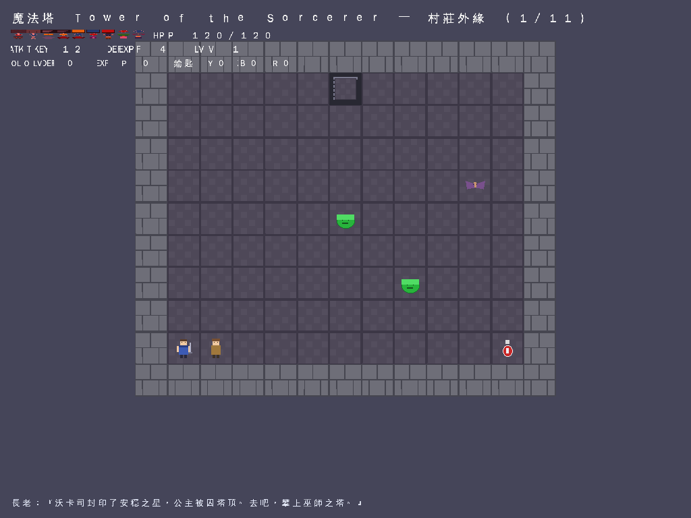
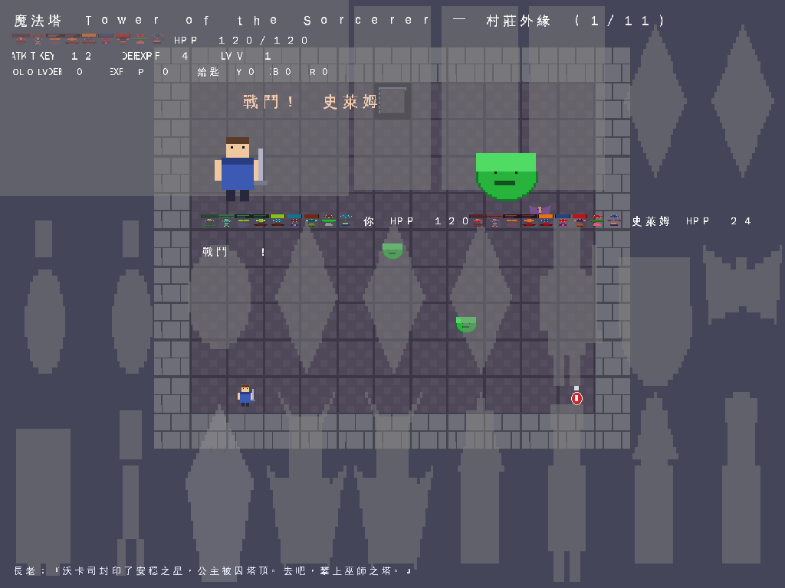
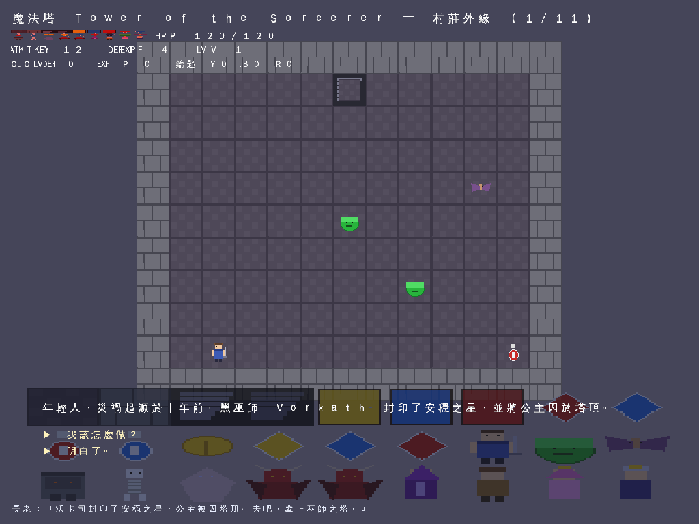
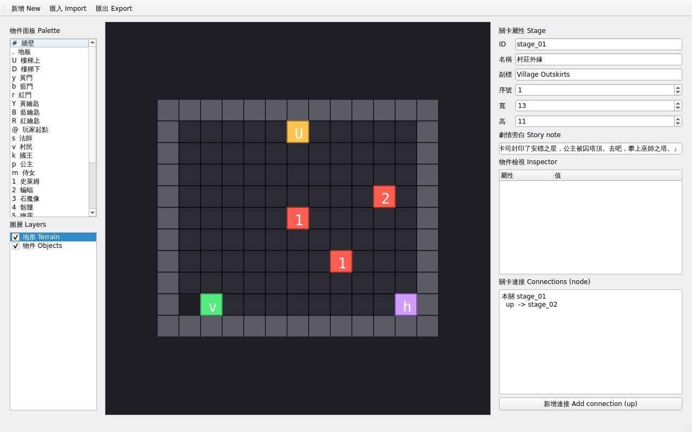

# 魔法塔：巫師之塔 (Tower of the Sorcerer) — Vulkan C++

A 2D dungeon-crawler / auto-battle RPG rendered with **Vulkan**, built on a
from-scratch Vulkan C++ engine. Runs **headless** (offscreen → PNG) and is
fully cross-platform (Windows + Linux).

## What it is
- 11 stages (13×11 grid) telling a story: the dark wizard **Vorkath** sealed the
  Star of Stability and imprisoned the princess atop the tower.
- **Talking system**: NPC dialogue trees with branches (Traditional Chinese).
- **Auto round-by-round combat**: player punches first, enemy retaliates; win →
  EXP/gold, level up; lose → respawn at stage start.
- Procedurally generated sprites (27) + a CJK font atlas (444 glyphs).

## Screenshots

**Game — Stage 1 (村莊外緣 / Village Outskirts)**
The top-down dungeon grid, HUD (stage name, ATK/DEF/LV/EXP/keys/HP), and the
story preamble. The engine renders every frame offscreen and dumps PNGs.


**Game — Auto combat**
Round-by-round combat vs. a slime: player strikes first, the enemy retaliates.
The right HUD shows the enemy's HP; the bottom shows narrative dialogue.


**Game — Dialogue**
Branching NPC dialogue (Traditional Chinese) from the talking system.


**Stage Editor (Qt6)**
Cross-platform editor with a node-grid canvas, a 3-layer model
(terrain / objects / annotations), a palette, an inspector, and
import/export of the game's stage JSON. The screenshot below was grabbed
headlessly (`tower_editor --shot stage01.json out.png`) on Linux/WSL.


## Build — Windows (Visual Studio)
Prerequisites:
1. Install **Visual Studio 2022** with *Desktop development with C++*.
2. Install the **Vulkan SDK** (LunarG) → https://vulkan.lunarg.com/sdk/home
   (this sets `VULKAN_SDK`; the CMake `find_package(Vulkan)` picks it up
   automatically).
3. Install **CMake** (≥ 3.16) — bundled with VS or from cmake.org.

Steps (CMake preset / command line):
```
# from the project root (tower_vulkan/)
cmake -S . -B build -G "Visual Studio 17 2022" -A x64
cmake --build build --config Release
```
Then run the executable from the build output directory (Release/ or Debug/):
```
build\Release\tower_vulkan.exe
```
It writes PNG frames into a `frames\` folder next to the exe. The build copies
`assets/`, `data/`, and `src/shaders/` next to the executable automatically, so
no extra setup is needed. Shaders are **precompiled** (`*.spv`) and committed,
so you do NOT need `glslangValidator` on Windows.

> Tip: if you have a real GPU, the same code runs on it. For CI / no-GPU boxes,
> install the **Vulkan Runtime + SwiftShader** or the LunarG SDK's software
> loader; the engine selects the first `VK_QUEUE_GRAPHICS_BIT` device.

## Build — Linux / WSL (headless, lavapipe)
```
export VULKAN_SDK=$HOME/opt/vulkan-sdk/x86_64   # if using a local SDK
cmake -S . -B build -G Ninja
cmake --build build
VK_ICD_FILENAMES=/usr/share/vulkan/icd.d/lvp_icd.json ./tower_vulkan
```

## Project layout
```
src/
  main.cpp        scripted playthrough + PNG dump (cross-platform)
  game.cpp/.h     stage loader, talking system, combat, text rendering
  renderer.cpp/.h offscreen Vulkan 2D sprite/text renderer
  stage.h         stage/enemy/item data structures
  vk_util.h       minimal Vulkan helpers (loadSpv, createImage, beginOnce…)
  shaders/        sprite.vert / sprite.frag (+ precompiled .spv)
assets/           sprite PNGs, font atlas (png + json)
data/             stages (stage01..stage10), enemies.json, items.json,
                  combat.json, story.json, dialogue/*.json
external/         vendored stb_image(.h/.write.h) + nlohmann json.hpp
```

## Notes
- The `.spv` files are committed; to regenerate (optional, needs glslang):
  `glslangValidator -V src/shaders/sprite.vert -o src/shaders/sprite.vert.spv`
  (and the same for `.frag`). CMake does this automatically if it finds
  `glslangValidator` on your `VULKAN_SDK` path.
- Asset directory can be overridden with `ASSET_DIR` env var or `argv[1]`.
