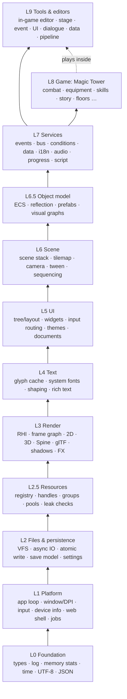

# 01 — System Hierarchy

Part of the [Engine Blueprint](README.md). This doc defines **the layers**, **every system in
them (with its ID)**, **the dependency rule**, and **the repo/CMake layout** that enforces it.
The per-system detail (build vs. adopt, what TOMS has today) lives in the system cards:

| Cards for | Doc |
|---|---|
| L0–L7 (runtime) | [02_RUNTIME_SYSTEMS.md](02_RUNTIME_SYSTEMS.md) |
| L2.5 in depth | [08_RESOURCE_AND_LIFETIME.md](08_RESOURCE_AND_LIFETIME.md) |
| L3 in depth | [09_RENDERING_2D_3D.md](09_RENDERING_2D_3D.md) |
| L6.5 + the in-game editor | [10_EDITOR_PREFAB_BLUEPRINT.md](10_EDITOR_PREFAB_BLUEPRINT.md) |
| L8 | [03_GAME_LAYER.md](03_GAME_LAYER.md) |
| L9 | [04_TOOLS_AND_EDITORS.md](04_TOOLS_AND_EDITORS.md) |
| QA | [05_DEV_WORKFLOW_VS.md](05_DEV_WORKFLOW_VS.md) |

---

## 1. The layers



### 1.1 Dependency rule

1. **A system may include only systems in its own layer or lower layers.** It must never include a higher one.
   Upward communication is only through interfaces the lower layer defines (callbacks, the event bus,
   handler registries such as [EventSystem's `IStepHandler`](../EventSystem/02_GAME_INTEGRATION.md)).
2. **Nothing loads a file or creates a GPU/audio object except through L2.5 Resources.**
3. **L8 (game) never includes L9 (editor).** The editor attaches to the running game through L6.5
   reflection. A shipping build compiles L9 out entirely (`ENGINE_EDITOR=OFF`).
4. **Every engine module has a headless test target** that runs under the VS debugger with no
   window ([05 §3](05_DEV_WORKFLOW_VS.md#3-tests-in-test-explorer)).
5. Rules 1–3 are enforced by CMake target links (a module links only lower targets) plus a CI
   include-checker script, not by review.

## 2. Full system list

**72 engine/tool systems + 12 game systems.** **P0** means required before the first game screen
on the new base; **P1** before content scales; **P2** later or optional.

| ID | System | Pri | ID | System | Pri |
|---|---|---|---|---|---|
| **L0** | **Foundation** | | **L3** | **Render** (detail: [09](09_RENDERING_2D_3D.md)) | |
| 0.1 | Core types, containers, math | P0 | 3.1 | RHI (Vulkan / Metal / WebGPU / WebGL2) | P0 |
| 0.2 | Logging, assert, diagnostics | P0 | 3.2 | Frame graph (passes, render targets) | P0 |
| 0.3 | Object tracking & memory stats | P0 | 3.3 | 2D renderer (batch, order, 9-slice, scissor) | P0 |
| 0.4 | Time, timers, fixed-step clock | P0 | 3.4 | Spine 2D skeletal | P1 |
| 0.5 | Strings / UTF-8 | P0 | 3.5 | glTF parser | P1 |
| 0.6 | Serialization (JSON + schema) | P0 | 3.6 | 3D renderer (PBR, skinning, instancing) | P1 |
| **L1** | **Platform** | | 3.7 | Skeletal animation 3D | P2 |
| 1.1 | App lifecycle & main loop | P0 | 3.8 | Shadows (CSM, VSM, volumes, blob) | P1 |
| 1.2 | Window, display, DPI, safe area | P0 | 3.9 | 2D/3D composition (camera stack) | P1 |
| 1.3 | Input & action map | P0 | 3.10 | Particles / FX | P1 |
| 1.4 | Device / OS info & capabilities | P1 | 3.11 | Post-processing | P2 |
| 1.5 | Web page shell | P0 | 3.12 | Quality tiers | P1 |
| 1.6 | Threads & job system | P1 | **L4** | **Text** | |
| **L2** | **Files & persistence** | | 4.1 | Glyph cache & paged atlases | P0 |
| 2.1 | VFS & mounts (per-OS user dir) | P0 | 4.2 | Font sources (system font per platform) | P0 |
| 2.2 | Async IO & packages | P1 | 4.3 | Shaping & line breaking (CJK) | P1 |
| 2.3 | Atomic write, backup, recovery | P0 | 4.4 | Rich text & SDF text | P2 |
| 2.4 | Save data model & migrations | P0 | **L5** | **UI** | |
| 2.5 | Settings store | P1 | 5.1 | UI tree, layout, anchors, UI scale | P0 |
| **L2.5** | **Resources** (detail: [08](08_RESOURCE_AND_LIFETIME.md)) | | 5.2 | Widget library (Button, 9-slice, ScrollView…) | P0 |
| R.1 | Asset registry & manifest | P0 | 5.3 | Input routing, focus, navigation | P0 |
| R.2 | Resource manager (handles, groups, async, hot reload) | P0 | 5.4 | Themes & styles | P1 |
| R.3 | Object & particle pools | P1 | 5.5 | UI documents & data binding | P1 |
| R.4 | Leak & memory tooling, budgets | P0 | **L6** | **Scene** | |
| **L6.5** | **Object model** (detail: [10](10_EDITOR_PREFAB_BLUEPRINT.md)) | | 6.1 | Scene / state stack | P0 |
| O.1 | Entity-component model | P1 | 6.2 | Tilemap & world grid | P1 |
| O.2 | Reflection | P1 | 6.3 | Camera | P1 |
| O.3 | Prefabs & scene serialization | P1 | 6.4 | Sprite animation & tween | P1 |
| O.4 | Visual graph runtime (Blueprint-like) | P2 | 6.5 | Timers, sequencing, coroutines | P1 |
| **L7** | **Services** | | **L9** | **Tools & editors** (detail: [04](04_TOOLS_AND_EDITORS.md)) | |
| 7.1 | Event system (flows) | P1 | 9.1 | In-game editor framework | P1 |
| 7.2 | Event bus / messaging | P0 | 9.2 | Scene / prefab / UI editor | P1 |
| 7.3 | Condition evaluator | P1 | 9.3 | Stage / map editor (+ LDtk/Tiled) | P1 |
| 7.4 | Data registry & catalog | P0 | 9.4 | Event & visual-graph editor | P1 |
| 7.5 | Localization | P1 | 9.5 | Dialogue editor (or Ink) | P2 |
| 7.6 | Audio | P1 | 9.6 | Data-table & localization editor | P2 |
| 7.7 | Progress services (run / meta) | P1 | 9.7 | Asset viewers (sprite, Spine, glTF, FX) | P2 |
| 7.8 | Scripting (optional) | P2 | 9.8 | Asset pipeline & validators | P0 |
| **QA** | **Quality & delivery** (detail: [05](05_DEV_WORKFLOW_VS.md)) | | | | |
| Q.1 | Test framework + CTest | P0 | Q.4 | CI + web preview deploy | P1 |
| Q.2 | Headless & golden-image tests | P1 | Q.5 | Profiling & crash reporting | P1 |
| Q.3 | Web end-to-end tests | P1 | | | |

Counts:

| Layer | Systems | P0 |
|---|---|---|
| L0 | 6 | 6 |
| L1 | 6 | 4 |
| L2 | 5 | 3 |
| L2.5 | 4 | 3 |
| L3 | 12 | 3 |
| L4 | 4 | 2 |
| L5 | 5 | 3 |
| L6 | 5 | 1 |
| L6.5 | 4 | 0 |
| L7 | 8 | 2 |
| L9 | 8 | 1 |
| QA | 5 | 1 |
| **Total** | **72** | **29** |

The 12 game systems (L8) are listed in [03](03_GAME_LAYER.md).

## 3. Repo and CMake layout

```
<repo>/
  CMakeLists.txt  CMakePresets.json  vcpkg.json        # one project, VS Open Folder (05)
  engine/
    core/        L0   target eng_core
    platform/    L1   target eng_platform      -> eng_core
    vfs/         L2   target eng_vfs           -> eng_platform
    resource/    L2.5 target eng_resource      -> eng_vfs
    render/      L3   targets eng_rhi, eng_framegraph, eng_render2d, eng_render3d, eng_fx
    text/        L4   target eng_text          -> eng_render2d
    ui/          L5   target eng_ui            -> eng_text
    scene/       L6   target eng_scene         -> eng_ui
    object/      L6.5 target eng_object        -> eng_scene
    services/    L7   targets eng_event, eng_bus, eng_condition, eng_data, eng_i18n, eng_audio, eng_progress
    editor/      L9   target eng_editor        (only when ENGINE_EDITOR=ON)
    <module>/tests/   one test target per module, registered with CTest
  games/
    magictower/  L8   target mt_game (+ mt_game_tests); data/ assets/ live here
  tools/              asset pipeline, validators, dev_server.py  (L9.8)
  docs/
```

- **One executable per game per platform**, plus the editor built into dev builds of that same
  executable. There is no separate editor app ([10](10_EDITOR_PREFAB_BLUEPRINT.md)).
- **Third-party libraries come from the `vcpkg.json` manifest** (or `FetchContent` for header-only
  libraries). There is no vendored `external/` folder except patches. See
  [07](07_THIRD_PARTY_LIBRARIES.md).
- **Build flags:**
  - `ENGINE_EDITOR` (ON in Debug/Dev, OFF in Shipping)
  - `ENGINE_RHI` (`vulkan|webgpu|webgl2|auto`)
  - `ENGINE_ASAN`
  - `ENGINE_TRACY`

## 4. Mapping from TOMS today

| TOMS today | Goes to |
|---|---|
| `src/engine/log.h`, `object.h`, `condition.*`, `event_bus.h`, `power_bar.*`, `encounter.*`, `entity_status.*` | L0.2, L0.3, L7.3, L7.2, L8, L8, L8 |
| `src/engine/node.*`, `scene.h`, `game_state.h` | L5.1 / L6.1 (node tree kept; the state machine becomes the real scene stack) |
| `src/engine/render_iface.h`, `renderer*.cpp`, `batch_renderer.h`, `texture.*` | replaced by L3.1–3.3 + L2.5 |
| `src/engine/font.*` (incl. `buildFromCanvas`) | L4.1 / L4.2 (the canvas path is kept) |
| `src/game/core/main.cpp`, `src/engine/emscripten_main.cpp` | replaced by L1.1 + L1.5 |
| `src/game/core/game*.cpp` (the `Game` god object) | split into L6.1 scenes + L7 services + L8 systems |
| `src/game/ui/*` | L5 (the `dialogue_layout.h` pattern, one geometry for draw and hit test, becomes the widget rule) |
| `src/game/save/*` | L2.3–2.5, L7.7 |
| `src/game/systems/*` | L8 (reused as-is) |
| `editor/` (Qt) | replaced by L9.1–9.3 |
| `tools/*.py` | L9.8 |
