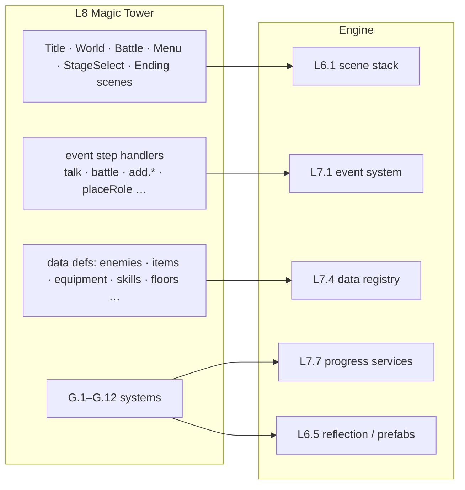

# 03 — Game Layer (L8): Magic Tower on the Engine

Part of the [Engine Blueprint](README.md). This doc covers what stays **game-specific**, what
TOMS already has for it, and how it sits on the engine layers from [01](01_SYSTEM_HIERARCHY.md).

---

## 1. The 12 game systems

Almost all of TOMS' gameplay logic is already **pure and tested**: it does not depend on `Game`,
the renderer or `Stage`. That is the most valuable thing to carry over. The table lists what each
system becomes.

| ID | System | TOMS today | Maturity | Verdict |
|---|---|---|---|---|
| G.1 | Combat (real-time power bar, damage, super gauge) | `src/engine/power_bar.*`, round logic in `src/game/core/game_combat.cpp` | solid math, logic mixed into `Game` | **reuse** `power_bar`; move the round loop out of `Game` into `BattleScene` + a `CombatSystem` |
| G.2 | Encounter resolution | `src/engine/encounter.*` | partial (no data uses overrides) | reuse |
| G.3 | Per-tile entity status | `src/engine/entity_status.*` | solid | reuse; the stage system owns it (also stores event-placed roles) |
| G.4 | Equipment | `src/game/systems/equipment_system.*` | solid | reuse |
| G.5 | Equipment actives | `src/game/systems/equipment_actives.*` | partial | reuse, then finish the two unset statuses |
| G.6 | Skill tree | `src/game/systems/skill_system.*` | solid | reuse |
| G.7 | Forge | `src/game/systems/forge_system.*` | solid | reuse |
| G.8 | Village hub | `src/game/systems/hub_system.*` | solid (only a "talk" action) | reuse |
| G.9 | Missions | `src/game/systems/mission_system.*` | solid logic, thin content | reuse; subscribe to `EventSignal` |
| G.10 | Run state & story progress | `src/game/systems/run_state.*`, `story_controller.h` | solid | reuse as the game's L7.7 progress schema |
| G.11 | Cycles & endings | `src/game/systems/cycle_system.*`, `ending_system.*` | partial (rules live in `Game::rebirth`) | reuse; move the rebirth rules in |
| G.12 | Floor rules (70-floor table, footprints, roamers) | `src/game/systems/floor_table.*`, `footprint.h`, `roamer.*` | solid | reuse |

The existing `*_test.cpp` files move with their systems into `games/magictower/tests/` and are
registered with CTest ([05](05_DEV_WORKFLOW_VS.md)).

## 2. What replaces the `Game` god object

`src/game/core/game.h` (871 lines, ~190 members) mixes loading, input, combat, dialogue,
inventory, store, menus, title, saves, endings, missions, notifications, audio, debug hooks and all
drawing. On the engine it is split along the layers:

| Today inside `Game` | Becomes |
|---|---|
| title / slot glue (`game_title_glue.cpp`) | `TitleScene` (L6.1) with UI documents (L5.5); `title_screen.*` page logic is reused |
| floor play, movement, stairs (`game_input.cpp`, `game_assets.cpp`) | `WorldScene` + tilemap (L6.2) + camera (L6.3) + floor rules (G.12) |
| combat overlay (`game_combat.cpp`) | `BattleScene` (pushed on the scene stack) + G.1 |
| dialogue (`game_story.cpp`) | a `DialogueSystem` service; the `talk` step handler lives here ([EventSystem 02 §3](../EventSystem/02_GAME_INTEGRATION.md)) |
| inventory, store, menus (`game_inventory.cpp`, `game_store.cpp`) | UI prefabs (L5 widgets: 9-slice panels, grid ScrollView, Buttons) bound to G.4–G.8 through reflection (L6.5) |
| ~30 `int xxxRect_[4]` hit-test fields + the `handleTouch` if-chain | deleted: widgets hit-test themselves (L5.3) |
| ~15 `bool` modal flags (`modalActive()`) | the scene stack: the top scene owns input |
| notifications, audio, ImGui debug windows | L5 toast widget, L7.6 audio, L9 editor panels |
| `readJsonFile(dataDir + "/../data/…")` everywhere | L7.4 data registry over L2.5 resources |
| endings / rebirth | an `EndingScene` + G.11 |

## 3. How the game plugs into the engine

- **Registration, not modification.** The game registers its scenes, its components (reflected,
  so they appear in the editor), its data types (each with a JSON schema), its event step handlers
  and its save schema. No engine file is edited to add a game feature.
- **Content is data plus prefabs.** Enemies, NPCs, items, doors and stairs become prefabs
  (`*.prefab.json`) placed by the stage editor or LDtk. Floors keep today's generated JSON
  (`tools/gen_floors.py`), validated by `tools/validate_story.py` plus the new schema validator.
- **Data files move** from `data/` to `games/magictower/data/`. The ones only tools use
  (`combat.json`, `story.json`, `events/pool_*.json`, `story/flags.json`) are tagged `tool-only`
  in the manifest, so they are not shipped to the web ([08 §2](08_RESOURCE_AND_LIFETIME.md#2-asset-registry-and-manifest-r1)).

## 4. Order of porting

1. Pure systems G.2–G.12 plus their tests (they compile against L0/L7 only), on the first day of G-M1.
2. `WorldScene` with the tilemap, movement and stairs, and one floor rendering (needs L3.3, L6.1, L6.2).
3. `BattleScene` + G.1.
4. The dialogue service + the event system with the first flows ([EventSystem](../EventSystem/README.md)).
5. Menus and the store as UI prefabs.
6. Title, saves, endings.

The milestone mapping is in [06](06_START_PLAN.md).
