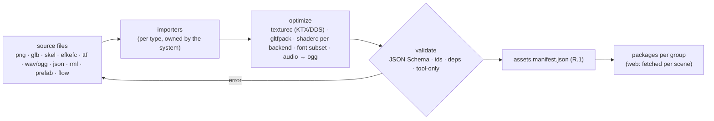

# 04 — Tools and Editors (L9)

Part of the [Engine Blueprint](README.md). All editors live in **one Qt6 desktop application,
`toms_editor`** (decided 2026-09-25). It links the engine and game libraries and shows the real
bgfx renderer in its viewports; it is **never shipped** and has no web build
([11](11_BGFX_QT_ARCHITECTURE.md)). The editors share the editor framework, prefab system and
binding from [10](10_EDITOR_PREFAB_BLUEPRINT.md). This doc lists each editor, the external tools
adopted beside them, and the asset pipeline.

---

## 1. Editor cards

| ID | Editor | Pri | TOMS today | ⭐ Recommendation | Adopt instead / beside |
|---|---|---|---|---|---|
| 9.1 | **Editor framework** (dock, hierarchy, inspector, asset browser, undo, play-in-editor, dev server) | P1 | Qt6 `editor/` main window (no docking, no undo) | build on **Qt6 Widgets** + **Qt Advanced Docking System**, `QUndoStack`, a reflection-driven inspector, and a **bgfx viewport widget** ([10 §2](10_EDITOR_PREFAB_BLUEPRINT.md#2-the-qt-editor-91), [11 §2](11_BGFX_QT_ARCHITECTURE.md#2-embedding-bgfx-in-the-qt-editor)) (L) | QDockWidget only (simpler, weaker layouts) |
| 9.2 | **Scene / prefab / UI editor** | P1 | none | build in Qt: prefab mode + UI placement + 3 binding levels ([10 §3–4](10_EDITOR_PREFAB_BLUEPRINT.md#3-object-model-l65)); the UI preview is the game's own UI runtime rendered by bgfx in the viewport (L) | external UI authoring tools whose output the runtime reads ([11 §4](11_BGFX_QT_ARCHITECTURE.md#4-ui-authoring-tools-whose-output-bgfx-can-use)) |
| 9.3 | **Stage / map editor** | P1 | Qt6 `editor/` (~1.1k lines): terrain/object layers, palette, inspector, stage JSON import/export. **Drifting**: 27 hard-coded types in `catalog.h`; knows nothing of footprints, the 70 floors or markers; does not link engine code; `editor_validate.cpp` is not built | **grow the Qt editor**: replace `catalog.h` with the engine's data registry (7.4), draw the stage through the bgfx viewport, add footprints, the 70 floors, markers and event trigger zones, and build `editor_validate.cpp` as a CTest test (M–L) | **LDtk** or Tiled for layout, imported by the pipeline (their JSON is renderer-agnostic) |
| 9.4 | **Event & visual-graph editor** | P1 | designed ([EventSystem 03](../EventSystem/03_EVENT_EDITOR.md), [04](../EventSystem/04_FLOW_PREVIEW.md)), originally as a Qt mode | build in the Qt editor on **QtNodes** (as the EventSystem docs originally designed); simulator + path explorer as designed; live preview runs the flow in the bgfx viewport (L) | Qt's `QGraphicsView` directly |
| 9.5 | **Dialogue editor** | P2 | hand-written `data/dialogue/*.json` | decision card: **adopt Ink** (the Inky editor + inkcpp runtime) or keep the JSON with a small graph view in 9.4 | Yarn Spinner (no standalone official C++ runtime) |
| 9.6 | **Data-table & localization editor**, save inspector | P2 | none (JSON by hand / AI) | build: a schema-driven table editor over 7.4 (forms generated from JSON Schema), a missing-key view for 7.5, and a save inspector over 2.4 (M) | spreadsheets exported to JSON as a stopgap |
| 9.7 | **Asset viewers** (sprite/atlas, Spine, glTF + material/light, particles, shadow debug) | P2 | none | build as Qt panels, each with a bgfx viewport (M) | Spine Editor, Blender, the Effekseer tool for authoring |
| 9.8 | **Asset pipeline & validators** | P0 | Python tools (below); no import pipeline; the whole folder is preloaded on web | build: importers → manifest (R.1) → packages (2.2); schema validation for all data (M–L) | bgfx **shaderc** / **texturec** / **geometryc**, gltfpack, basisu / KTX-Software, fonttools |

## 2. External authoring tools (adopted)

| Tool | For | Output our runtime reads |
|---|---|---|
| **LDtk** (MIT) or **Tiled** (GPL editor; the output is yours) | 2D levels, entity placement, fields | LDtk JSON / TMX → stage data (6.2) |
| **Blender** | 3D scene layout, models | glTF 2.0 + `extras` custom properties → components / prefab ids |
| **Spine Editor** (paid, per developer) or **Rive** | 2D skeletal animation | `.skel`/`.json` + atlas, or `.riv` |
| **Effekseer** tool | particles / FX | `.efkefc` |
| **Inky** (if Ink is chosen) | branching dialogue | compiled ink JSON / binary |
| **Aseprite** / **LibreSprite** | pixel art and frame animations | PNG sheets → atlas |
| Spreadsheet (stopgap) | balance tables | CSV → JSON through the pipeline |

## 3. Asset pipeline (9.8)

- It runs as **CMake custom commands**, so VS builds and incremental rebuilds just work. Every
  step is also a CLI, so AI and CI can run it.
- **Validators** run as CTest tests (they fail the build in CI). They cover: every data file
  against its schema, every id reference, every event flow ([EventSystem](../EventSystem/README.md)),
  every prefab binding (method exists), and the story rules (today's `tools/validate_story.py`).
- **Fixes to carry over:**
  - `tools/subset_fonts.py` reads `src/game/game.cpp`, but the text literal moved to
    `src/game/core/game_assets.cpp`, so the script exits with an error today
  - root `gen_textures.py` and `make_review_pdf.py` hard-code Linux paths

## 4. TOMS tools: keep, fold in or retire

| Tool | Verdict |
|---|---|
| `tools/gen_floors.py`, `gen_mazes.py`, `gen_stairs.py` | **keep** as content generators for Magic Tower (`games/magictower/tools/`); they emit markers for the event system |
| `tools/validate_story.py` | **keep** and run it as a CTest test |
| `tools/gen_story_i18n.py` | **keep**; it becomes part of the localization missing-key flow |
| `tools/make_sprites.py`, `gen_sfx.py` | keep as placeholder-art generators |
| `tools/make_item_icons.py`, `make_missing_sprites.py` | retire (superseded by `make_sprites.py`) |
| root `gen_content.py`, `gen_textures.py`, `make_review_pdf.py` | retire (legacy, hard-coded paths) |
| `tools/run_web_debug.ps1` | keep; generalized for the web F5 target ([05 §4](05_DEV_WORKFLOW_VS.md#4-f5-targets)) |
| `editor/` (Qt6) | **keep**: it becomes `toms_editor` (9.1–9.4). The stage editor is its first mode |
