# 06 — Start Plan: From TOMS to Engine + Magic Tower

Part of the [Engine Blueprint](README.md). This doc covers what to reuse, rewrite or retire from
TOMS; the bugs to fix even before the new project starts; and the milestone order to a first
playable game on the new base.

---

## 1. Reuse, rewrite, retire

| Verdict | What |
|---|---|
| **Reuse as-is** (move + register tests) | `log.h`, `object.h`, `condition.*`, `localization.*`, `systems/camera.*`, every `src/game/systems/*`, `power_bar.*`, `encounter.*`, `entity_status.*`, the save model (`save_system.*`, `save_slots.*`, `game_settings.*`, `run_state.*`), `title_screen.*` page logic, **the canvas system-font path** (`Font::buildFromCanvas`), all `data/` content, the Python content generators and validators |
| **Reuse as a pattern** | `dialogue_layout.h` (one geometry for draw + hit-test becomes the rule for every widget); `batch_renderer.h` batching; `ui_root.h` UI scale; the `game_state.h` transition table (becomes the real scene stack); the **Event System design** (`docs/EventSystem/`) |
| **Extend** | `event_bus.h` (unsubscribe tokens + queued mode); `save_system` (migrations, `.bak`); `font.*` (paged atlas, per-platform glyph sources); `Audio` (cache, buses, music) |
| **Rewrite on adopted libraries** | the two mains → SDL3 app (L1); three renderers + `render_iface.h` → bgfx (L3; first as a `BgfxRenderer : IRenderer` port, [11 §6](11_BGFX_QT_ARCHITECTURE.md#6-migration-path-from-toms)); immediate-mode UI + ~30 hit-rect fields → RmlUi/widgets (L5); the `Game` god object → scenes + services ([03 §2](03_GAME_LAYER.md#2-what-replaces-the-game-god-object)); the web page JS in strings → `shell.html` + `engine.js` |
| **Extend (tools)** | the Qt `editor/` becomes `toms_editor`: links the engine, embeds a bgfx viewport, reads the data registry instead of `catalog.h` |
| **Retire** | the hand-written Vulkan / WebGL / WebGPU backends and their `.spv` / GLSL ES / WGSL shaders (after the bgfx port matches); `texture.*` (unused); `make_item_icons.py`, `make_missing_sprites.py`, root `gen_content.py` / `gen_textures.py` / `make_review_pdf.py`; old build output folders (`web-gl/`, `web-gpu/`, `web/` versioned bundles) |

## 2. Fix now, in TOMS (worth it even before the new project)

| # | Bug | Where | Fix |
|---|---|---|---|
| 1 | **Windows saves stop updating after the first write.** C `std::rename` fails when the target exists, so every later save stays in `*.tmp`. This is visible on disk in `Debug/save/` | `src/game/save/save_system.cpp:142-155` (`writeJsonAtomic`) | use `std::filesystem::rename` (it replaces on MSVC) and keep a `.bak`. Add a test that overwrites an existing save (`save_test.cpp` currently deletes the target first) |
| 2 | WebGPU `flush()` clears and presents on every call, so the text pass wipes the sprites | `src/engine/renderer_webgpu.cpp` | **superseded:** the WebGPU backend is deleted by the bgfx port; do not fix |
| 3 | WebGPU `init` gets 1280×720 instead of the 1024×768 design size; there is no `updateFont` | `renderer_webgpu.cpp` | **superseded** (as 2); the bgfx port must pass the design size and implement `updateFont` |
| 4 | Font atlas can exceed `GL_MAX_TEXTURE_SIZE`, and then **no text draws at all**, silently | `src/engine/font.cpp` `makeTexture` | check the limit, log, and clamp the spare cells |
| 5 | `tools/subset_fonts.py` reads `src/game/game.cpp`, which moved | `tools/subset_fonts.py` | point it at `src/game/core/game_assets.cpp` |
| 6 | 30 test binaries, none registered with CTest (invisible to VS Test Explorer and CI) | `CMakeLists.txt` | `enable_testing()` + `add_test` per test |
| 7 | Hard-coded emsdk and node paths in presets | `CMakePresets.json` | `$env{EMSDK}` + `CMakeUserPresets.json` |
| 8 | Stale docs: `CODE_LAYOUT.md` line counts (`game.h` is 871 lines, not 591), `IMPLEMENTATION_ROADMAP.md` checkboxes | `docs/architecture/` | refresh |

## 3. Milestones

Each milestone has **exit criteria that are tests**, so "done" is checkable (Q.1–Q.4). Efforts are
AI-assisted and rough, taken from the recommended option on each card.

| Milestone | Systems | Exit criteria | Effort |
|---|---|---|---|
| **E-M0 Skeleton** | 0.1–0.6, 1.1–1.3, 1.5, 2.1, 2.3, 2.4, 3.1 (clear + quad), Q.1, the VS workflow ([05](05_DEV_WORKFLOW_VS.md)) | F5 desktop (bgfx on D3D11 **and** Vulkan) and F5 web (bgfx WebGL2) show a textured quad drawn with a `shaderc`-compiled shader; **`toms_editor` shows the same quad in a docked bgfx viewport and survives resize, undock and DPI change**; the shipping preset builds with no Qt installed; Test Explorer lists all tests; CI builds both; natvis works; the save overwrite test passes. **Also: the TOMS `BgfxRenderer` port renders stage 1 identically to the Vulkan build** (golden image) | 2–3 weeks |
| **E-M1 Resources + 2D** | R.1, R.2, R.4, 3.2, 3.3, 4.1, 4.2, Q.2 | sprites, 9-slice, scissor and text in the correct draw order; the canvas font on web, a system font on desktop; golden images pass; **the 100× load/unload soak shows zero leaks on desktop and web** ([08 §8](08_RESOURCE_AND_LIFETIME.md#8-leak-and-memory-tooling-r4-all-automated)) | 3–4 weeks |
| **E-M2 UI + Spine** | 5.1–5.5 (RmlUi or own), 1.4, 3.4, 3.12, 6.4, R.3 | a widget gallery (Button, 9-slice, ScrollView, virtualized grid, dialog stack, virtual pad) at phone, desktop and web sizes; a Spine character plays; UI documents hot-reload | 3–4 weeks |
| **E-M3 Scenes + services** | 6.1–6.3, 6.5, 7.2–7.7, 2.2, 2.5 | a scene stack with per-scene groups; per-scene web packages; audio with music and buses; data registry + schema validation in CI | 2–3 weeks |
| **G-M1 First playable** | L8 (G.1–G.12), 7.1 (event system), 9.8 | Magic Tower floors F01–F07 playable on desktop and web: move, fight, talk, pick up, stairs, save/load; one event flow runs; all ported system tests pass | 3–4 weeks |
| **E-M4 Editor + prefabs** | O.1–O.3, 9.1–9.4 | Qt editor (desktop): hierarchy, inspector, prefabs with overrides, UI placement, **C++ method binding + Event System binding**, play-in-editor in the bgfx viewport; the stage editor reads the data registry; the event editor (QtNodes) + simulator work | 4–6 weeks |
| **E-M5 3D** | 3.5, 3.6, 3.8, 3.9, 3.10, 3.11, 1.6 | a glTF scene with PBR + CSM shadows, a Spine/sprite character inside it, particles, UI over it; golden images per tier; the 3D soak shows no leaks | 4–6 weeks |
| **E-M6 Graphs + polish** | O.4, 9.5–9.7, 3.7, Q.3–Q.5, 4.3–4.4 | visual graphs with live debugging; dialogue/data/asset editors; Playwright e2e in CI; preview deploy per branch; crash reporting | 4–6 weeks |

After E-M3 the order can flex. G-M1 can overlap E-M4, and E-M5 is independent of the editor work.

```mermaid
gantt
    dateFormat  X
    axisFormat  w%s
    section Engine
    E-M0 Skeleton          :m0, 0, 3
    E-M1 Resources + 2D    :m1, after m0, 4
    E-M2 UI + Spine        :m2, after m1, 4
    E-M3 Scenes + services :m3, after m2, 3
    E-M4 Editor + prefabs  :m4, after m3, 5
    E-M5 3D                :m5, after m3, 5
    E-M6 Graphs + polish   :m6, after m4, 5
    section Game
    G-M1 First playable    :g1, after m3, 4
```

The chart is in weeks and only shows ordering. The effort column above is the estimate.
