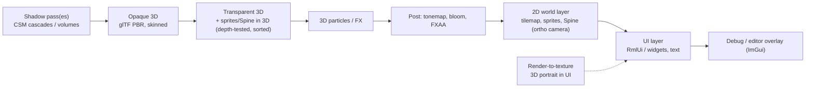

# 09 — Rendering: 2D + 3D Mixed (L3)

Part of the [Engine Blueprint](README.md). This doc covers the render layer for a game that mixes:
- 2D sprites, tilemaps, UI and **Spine** skeletons
- **glTF 3D models** with **shadows**
- 2D sprites/Spine *inside* a 3D scene, and 3D inside UI

Targets: **Vulkan** on desktop/Android, Metal (or MoltenVK) on Apple, and **WebGPU with a WebGL2
fallback** on the web. Library facts are dated 2026-09 with sources in
[07](07_THIRD_PARTY_LIBRARIES.md).

---

## 1. What TOMS has, and why it is replaced

- **Three hand-written backends** (`renderer.cpp` Vulkan, `renderer_webgl.cpp`, `renderer_webgpu.cpp`)
  behind `render_iface.h`. That interface supports **one sprite atlas + one font atlas**, with no
  render targets, scissor, blend modes, transforms or depth.
- **Every backend draws all sprites first, then all text**, so a panel can never cover text.
  `game_title_glue.cpp` works around this.
- **The WebGPU backend is broken:**
  - `flush()` clears and presents on every call, so the text pass wipes the sprites
  - `init` gets 1280×720 instead of the 1024×768 design size
  - it has no `updateFont`
- **Shader logic exists three times** (SPIR-V, GLSL ES, WGSL), plus a 15-float vertex layout.
- **No headless capture any more** (`savePNG` is a stub).
- `batch_renderer.h` (Vulkan) is solid, and its batching idea carries into 3.3.

Extending this to 3D + shadows + Spine across three APIs is the most expensive thing the project
could build itself. It is the clearest case for adopting.

## 2. Decision card: 3.1 RHI (graphics API abstraction)

| | ⭐ **Diligent Engine** | **sokol_gfx** | **WebGPU everywhere (Dawn)** | bgfx | Filament (full renderer) |
|---|---|---|---|---|---|
| Licence | Apache-2.0 | zlib | BSD-3 | BSD-2 | Apache-2.0 |
| Desktop / Android | **Vulkan**, D3D11/12, GL/GLES | D3D11, GL, Metal; **Vulkan experimental** (added Dec 2025, still marked experimental) | via Dawn on **Vulkan** / D3D12 / Metal | Vulkan, D3D11/12, GL, Metal | Vulkan, GL/GLES, Metal |
| Apple | Metal backend **needs a commercial licence on iOS** → use **Vulkan via MoltenVK** | Metal | Metal via Dawn | Metal | Metal |
| Web | **WebGPU** + GL (WebGL) | **WebGL2 + WebGPU** | browser WebGPU through `emdawnwebgpu`; **no WebGL2 fallback** | **WebGL only** (its WebGPU is Dawn-native only) | **WebGL2**; WebGPU experimental |
| 3D extras | **DiligentFX**: glTF PBR renderer, shadows, post-FX (which FX components run on WebGPU/GL is **not documented; test first**) | none (build 3D) | none (build 3D) | examples only | best-in-class PBR, gltfio, many shadow filters |
| Fit with our own 2D + UI passes | one RHI for everything | one RHI | one API | one RHI | **owns its render loop**, so sharing a frame with our 2D/UI passes is awkward |
| Size / complexity | large | tiny, header-only | medium (big to build) | medium | large |
| Maintenance | active | very active | active (Google) | active | active |

**Recommendation: Diligent Engine.** It is the only candidate that covers **Vulkan on
desktop/Android *and* WebGPU on the web *and* a GL/WebGL fallback**, with a glTF PBR + shadow
module to start from. It keeps one API for 2D, 3D and UI. On Apple, run its Vulkan backend on
MoltenVK to avoid the commercial Metal licence.

- **Risk to check in E-M0:** build a clear-screen + one textured quad on all three targets. If
  Diligent's web builds are too large or immature, fall back to **sokol_gfx** (web: WebGL2 + WebGPU;
  desktop: D3D11/GL until its Vulkan backend is no longer experimental). With sokol, the 3D renderer
  (3.6) is built rather than taken from DiligentFX.
- **Rejected:** bgfx (no browser WebGPU); Filament as the RHI (its own loop, and WebGPU is still
  experimental). Filament remains a good *reference* for PBR and shadow filtering.

### 2.1 Shaders (one source)

- Author shaders once, in **HLSL or Slang**.
- **Diligent** compiles HLSL/GLSL to each backend itself; confirm its WGSL path in E-M0.
- **Otherwise:** Slang → **SPIR-V** (stable), then SPIR-V → WGSL with Tint/Naga and → GLSL ES /
  MSL with SPIRV-Cross. **Slang's direct WGSL and MSL targets are still experimental**, so do not
  depend on them yet.
- Shader permutations per quality tier are built by the asset pipeline (L9.8) and cached as resources (R.2).

## 3. The frame (3.2 frame graph)

A small frame graph declares passes and their render targets. It handles transient target reuse
and barriers, and it lets quality tiers remove passes.

A 2D-only scene simply has no 3D passes, so Magic Tower's current floors run through the same graph
at almost no cost.

## 4. Sub-system cards

| Card | Pri | Scope | ⭐ Recommendation | Alternatives |
|---|---|---|---|---|
| **3.3 2D renderer** | P0 | batched quads with **real draw order** (layer + sort key; text is an ordinary batch), 9-slice, scissor/clip rects (ScrollView), tint/blend modes, atlases from R.2 | **build** on the RHI, reusing the batching idea of `batch_renderer.h` (M) | sokol_gl / sokol_sprite-style helpers if sokol is chosen |
| **3.4 Spine 2D** | P1 | skeleton playback, mixing, skins, events → the event bus; rendered by 3.3 (2D) or as quads in 3D (3.9) | **spine-cpp**. *Licence:* every developer who integrates it must own a **Spine Editor licence*; the runtime can then ship | **Rive** runtime (MIT; has WebGL/WASM, Vulkan, D3D, Metal backends). DragonBones (MIT) is **stale since 2018: avoid** |
| **3.5 glTF parser** | P1 | glTF 2.0/GLB: meshes, PBR materials, skins, morphs, animations; KHR_texture_basisu, KHR_mesh_quantization, EXT_meshopt | **fastgltf** (MIT, fast, C++17) | **cgltf** (MIT, single header); tinygltf (MIT, maintenance unclear) |
| **3.6 3D renderer** | P1 | forward (clustered later), unlit + PBR metal-rough, normal maps, GPU skinning, instancing, optional IBL | **DiligentFX** PBR renderer if it runs on the web targets (test in E-M5), otherwise **build** a forward PBR on the RHI (L) | Filament as a reference |
| **3.7 3D skeletal animation** | P2 | clip sampling, blending, optional IK, glTF skins | **ozz-animation** (MIT) | own sampler (M) |
| **3.8 Shadows** | P1 | see §5 | CSM + PCF (build or DiligentFX) | volumes, VSM, blob |
| **3.9 2D/3D composition** | P1 | camera stack (3D perspective → 2D ortho → UI); **billboards / depth-tested sprite and Spine quads in 3D**, sorted with transparents; render-to-texture for 3D-in-UI; shared depth when 2D must occlude 3D | **build** on the frame graph (M) | — |
| **3.10 Particles / FX** | P1 | 2D + 3D emitters, pooled ([08 §6](08_RESOURCE_AND_LIFETIME.md#6-pools-for-objects-and-particles-r3)) | **Effekseer** (MIT; desktop backends + WebGL via EffekseerForWebGL; a newer version adds WebGPU) | own simple emitter (M) |
| **3.11 Post-processing** | P2 | tonemap, bloom, FXAA, color grading | **build** (S–M), or DiligentFX post-FX | — |
| **3.12 Quality tiers** | P1 | see §6 | **build** (S) | — |

## 5. Shadows (3.8)

| Technique | Use | Web notes | Cost |
|---|---|---|---|
| ⭐ **Cascaded shadow maps + PCF** | default for directional light | works on **WebGPU and WebGL2** (depth textures + comparison samplers) | L to build; given by DiligentFX if usable |
| Spot / point shadow maps | torches and similar | point lights need a cube map or 6 views, which is costly on web; limit count per tier | M |
| VSM / EVSM | soft shadows on desktop tier | needs float render targets (check WebGL2 extensions per device) | M |
| **Stencil shadow volumes** | optional crisp hard shadows for low-poly scenes | stencil is available on WebGL2 and WebGPU; **silhouette extraction must run on the CPU on WebGL2** (no compute); on WebGPU/Vulkan it can be a compute pass. Cost grows with silhouette edge count; needs closed meshes | L; P2 |
| **Blob / projected shadows** | sprites and Spine in 3D, low tier | trivial everywhere | S |

The shadow debug views (cascade colors, the shadow map itself, volume wireframe) are editor panels
(L9.7).

## 6. Quality tiers (3.12)

| Tier | Chosen when | Shadows | Other |
|---|---|---|---|
| Desktop | Vulkan/D3D desktop | 3–4 cascades, 2048², PCF 5×5 or VSM | MSAA 4×, full post |
| Mobile | Android/iOS | 2 cascades, 1024², PCF 3×3 | MSAA 2× or FXAA, reduced post |
| Web-WebGPU | browser with WebGPU | 2 cascades, 1024² | FXAA, bloom optional |
| Web-WebGL2 | fallback | 1 cascade, 1024², or blob only | FXAA, no bloom |

The tier is chosen from device capabilities (L1.4) at startup. It can be overridden in settings
(L2.5), and it also sizes pools and memory budgets ([08 §9](08_RESOURCE_AND_LIFETIME.md#9-budgets)).

## 7. Resources and tests

- **New resource types** (in [08 §10](08_RESOURCE_AND_LIFETIME.md#10-resource-types-covered)): mesh,
  material, glTF scene (a dependency tree), skeleton, animation clip, Spine skeleton + atlas, effect,
  shader permutation. Frame-graph render targets are recreated on resize or tier change through the
  deferred-destroy queue.
- **Pipeline** (L9.8): **gltfpack / meshoptimizer** (MIT) to optimize glTF, and **Basis Universal /
  KTX2** (Apache-2.0) textures for small web downloads.
- **Tests** (Q.2):
  - offscreen golden images per tier for a 2D scene, a glTF + CSM scene and a mixed scene
  - the 100× load/unload soak includes a 3D scene
  - GPU timings per pass: Tracy GPU zones on desktop; WebGPU timestamp queries where the browser allows them (Tracy cannot instrument the web build)
