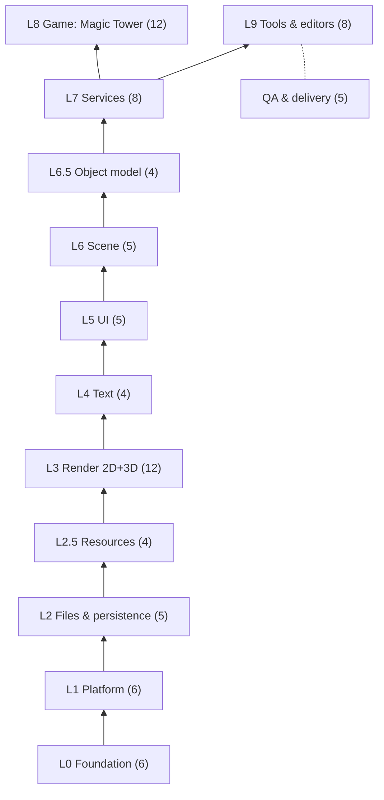

# Engine Blueprint — Index

> Status: **planning document** (2026-09-24). Nothing here is built yet.

## Purpose

This folder answers **"which systems does a new project need, starting from what TOMS already
has?"** The new project is a **reusable C++ engine** with **Magic Tower as its first game**.

Constraints taken as given:

| Constraint | Meaning |
|---|---|
| **C++**, high performance | engine and game logic in C++ |
| **Web with no install** | browser builds use WebGPU with a WebGL2 fallback |
| **Vulkan** on desktop/mobile | native graphics backend |
| **2D + 3D mixed** | Spine, glTF, shadows |
| **In-game editor** | prefabs, UI and code binding, usable on web too |
| **Visual Studio F5** | the game, the editor and every test |
| **Managed resources** | preload/release by scope, no leaks, checked automatically |
| **Adopt reliable libraries** | build only where nothing fits |

## The hierarchy at a glance

**72 engine and tool systems** (29 of them P0, required before the first game screen), plus **12
game systems**. The full list with IDs and priorities is in
[01 §2](01_SYSTEM_HIERARCHY.md#2-full-system-list).

## Headline recommendations

1. **Adopt the expensive, solved parts:**
   - **SDL3** (platform)
   - **Diligent Engine** (RHI: Vulkan desktop/Android, WebGPU + GL on web; fallback sokol_gfx)
   - **RmlUi** (game UI with 9-slice and scroll views), **Dear ImGui** (tools)
   - **flecs / EnTT** (objects + reflection)
   - **fastgltf**, **ozz-animation**, **spine-cpp** / **Rive**, **Effekseer**
   - **miniaudio**, **nlohmann/json + JSON Schema**, **doctest + CTest**, **vcpkg**
   - Details: [07](07_THIRD_PARTY_LIBRARIES.md).
2. **Build the parts that are the engine's identity:** resource and lifetime management
   ([08](08_RESOURCE_AND_LIFETIME.md)), the frame graph and 2D/3D composition
   ([09](09_RENDERING_2D_3D.md)), the event system ([EventSystem](../EventSystem/README.md)),
   prefabs + binding + the in-game editor ([10](10_EDITOR_PREFAB_BLUEPRINT.md)), and the save model.
3. **Keep TOMS' best assets:**
   - the pure, tested gameplay systems
   - the condition evaluator, localization and logging
   - **the web system-font path that already avoids shipping font files**
   - all content data and generators
4. **Fix the known TOMS bugs now**, above all the Windows save that never overwrites
   ([06 §2](06_START_PLAN.md#2-fix-now-in-toms-worth-it-even-before-the-new-project)).

## How to read a system card

Each system has a card with these fields:

| Field | Content |
|---|---|
| **Needs** | requirements (desktop/mobile/web differences) |
| **TOMS** | today's files, maturity and reuse verdict |
| **A · Build** | own implementation, with an effort size |
| **B · Adopt** | library, and whether it builds with MSVC + Emscripten |
| **VS** | how it is debugged in Visual Studio |
| **Scope** | which resource scope it uses |

⭐ marks the recommendation. Efforts are AI-assisted and rough: S ≤ 2 days · M ≤ 1 week · L ≤ 3
weeks · XL > 3 weeks.

## Documents

| # | Doc | Covers |
|---|---|---|
| 1 | [01_SYSTEM_HIERARCHY.md](01_SYSTEM_HIERARCHY.md) | layers, dependency rule, the full system list with counts, repo/CMake layout, TOMS → new mapping |
| 2 | [02_RUNTIME_SYSTEMS.md](02_RUNTIME_SYSTEMS.md) | system cards for L0–L7 |
| 3 | [03_GAME_LAYER.md](03_GAME_LAYER.md) | the 12 Magic Tower systems; replacing the `Game` god object |
| 4 | [04_TOOLS_AND_EDITORS.md](04_TOOLS_AND_EDITORS.md) | editor cards, external authoring tools, asset pipeline, TOMS tools keep/retire |
| 5 | [05_DEV_WORKFLOW_VS.md](05_DEV_WORKFLOW_VS.md) | Visual Studio F5 for game/editor/tests, web debugging limits, natvis, QA systems |
| 6 | [06_START_PLAN.md](06_START_PLAN.md) | reuse/rewrite/retire, fix-now bug list, milestones with test-based exit criteria |
| 7 | [07_THIRD_PARTY_LIBRARIES.md](07_THIRD_PARTY_LIBRARIES.md) | library shortlist with licence, web support, status, confidence; starter stack; licence obligations |
| 8 | [08_RESOURCE_AND_LIFETIME.md](08_RESOURCE_AND_LIFETIME.md) | registry, handles, preload/release scopes, GPU lifetime, pools, hot reload, leak checks, budgets |
| 9 | [09_RENDERING_2D_3D.md](09_RENDERING_2D_3D.md) | RHI decision, frame graph, 2D/3D renderers, Spine, glTF, shadows (maps and volumes), quality tiers |
| 10 | [10_EDITOR_PREFAB_BLUEPRINT.md](10_EDITOR_PREFAB_BLUEPRINT.md) | engine/editor evaluation, in-game editor, ECS + reflection, prefabs, the three binding levels, visual graphs |

## Open decisions (each has a decision card)

| Decision | Options | Where |
|---|---|---|
| RHI | **Diligent** vs. sokol_gfx vs. WebGPU-everywhere (Dawn) | [09 §2](09_RENDERING_2D_3D.md#2-decision-card-31-rhi-graphics-api-abstraction) |
| Game UI | **RmlUi** vs. own widgets + Yoga/Clay | [02 L5](02_RUNTIME_SYSTEMS.md#l5-ui) |
| Object model | **flecs** vs. EnTT | [10 §3](10_EDITOR_PREFAB_BLUEPRINT.md#3-object-model-l65) |
| 2D skeletal | **Spine** (licence per developer) vs. Rive | [09 §4](09_RENDERING_2D_3D.md#4-sub-system-cards) |
| Dialogue | **Ink** vs. keep the own JSON format | [04 §1](04_TOOLS_AND_EDITORS.md#1-editor-cards) |
| Scripting | none (data + graphs) vs. Lua | [02 7.8](02_RUNTIME_SYSTEMS.md#78-scripting-optional--p2) |
