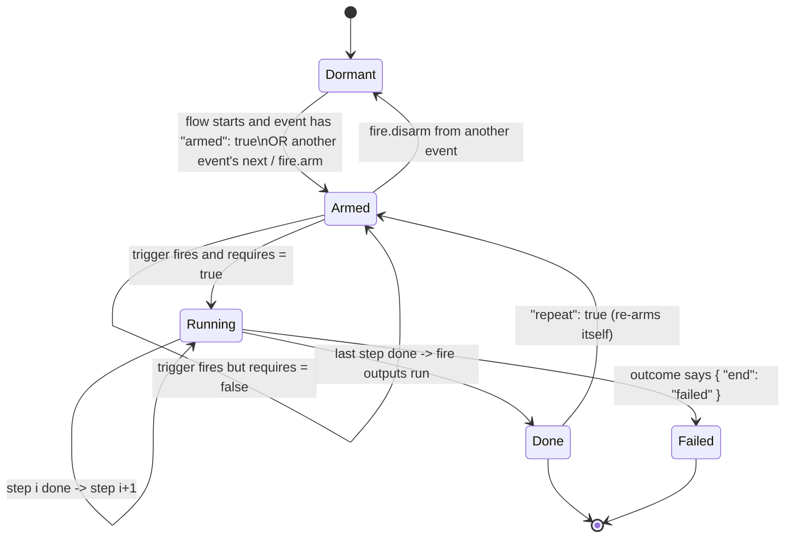

# 01 — Concepts and Data Schema

Part of the [Event System](README.md) design. This doc defines **what an event is** and **the
file format** the runtime parses. [02](02_GAME_INTEGRATION.md) covers how the game runs it.

---

## 1. Glossary

| Term | Meaning |
|---|---|
| **Flow** | One file in `data/event_flows/`. A named group of events that tell one piece of content (a side story, a chapter beat, a floor's set pieces). Has its own progress in the save. |
| **Event** | One node of a flow: a **trigger** (when), optional **requires** (only if), a list of **steps** (what happens), and **fire** outputs (what it leaves behind / what comes next). |
| **Trigger** | The game moment that starts an event: approaching a cell, talking to or picking up something, defeating an enemy, entering a floor, receiving a signal, … |
| **Requires** | A condition in the existing [Condition DSL](../../src/engine/condition.h), checked when the trigger fires. False → the event stays armed and does not run. |
| **Step** | One unit of work: `talk`, `battle`, `add`, `play`, `changeScene`, `action`, `wait`, `branch`. Some steps are **blocking** (they wait for the game to report completion). |
| **Outcome** | The result a blocking step reports: `done`, a battle's `win`/`lose`, or a dialogue's `choice:<optionId>`. Outcomes can redirect the flow. |
| **Fire** | Outputs that run after the last step: `placeRole` / `removeRole` / `moveRole` (place a role somewhere), `emit` (send event data), `arm` / `disarm` (control other events). |
| **Signal** | The payload of `emit`: a name plus a small JSON data object. Any event in any flow can use `trigger.on = "signal"` to listen for it. It is also published on the `EventBus` so missions can count it. |
| **Marker** | A named cell in a stage/floor file (`"markers": {"m_crypt_altar": [7,18]}`). Events point at markers, not raw coordinates, so a regenerated maze keeps working as long as the generator keeps the marker. |

## 2. Event lifecycle

Each event in a flow is in exactly one state. These states are what the save stores.



- **Dormant**: exists but does not listen. It is not drawn in-game and costs nothing at runtime.
- **Armed**: listening for its trigger. Only armed events are checked when a game hook fires.
- **Running**: executing steps. `stepIndex` shows where it is. At most **one event runs at a
  time** (see [02 §5](02_GAME_INTEGRATION.md#5-the-run-loop)); triggers that
  arrive meanwhile are queued.
- **Done / Failed**: finished. `Failed` is a first-class result, so a flow can react to "the
  player lost the fight" differently from "the player won".

A **flow** is `active` once its own `requires` is true (checked on floor enter and after every
event finishes). Before that, all of its events are held Dormant.

## 3. Flow file

```json
{
  "schema": "toms.eventflow/1",
  "id": "flow_ss05_crypt_choir",
  "title": { "zh_TW": "墓穴合唱", "en": "The Crypt Choir" },
  "scope": "run",
  "requires": { "type": "storyBeatAtLeast", "value": "ch_05" },
  "floors": ["F33", "F35"],
  "events": [ /* §4 */ ],
  "_editor": { /* §9 — ignored by the game */ }
}
```

| Field | Type | Req. | Notes |
|---|---|---|---|
| `schema` | string | ✔ | `toms.eventflow/1`. Lets the loader reject files it does not understand. |
| `id` | string | ✔ | Unique across all flows. Same as the file name. Prefix `flow_`. |
| `title` | i18n object or text key | | Shown in the editor and debug overlay only. |
| `scope` | `"run"` \| `"meta"` | ✔ | Where progress is saved: `run` resets on rebirth (most content), `meta` survives cycles (tutorials, one-time lore). |
| `requires` | Condition | | Gates the whole flow. Absent = always active. |
| `floors` | string[] | | Floors/stages this flow touches. Used for loading, the editor's map filter, and the validator. Not a gate. |
| `events` | Event[] | ✔ | §4. Order does not matter at runtime. |

## 4. Event

```json
{
  "id": "ev_hear_choir",
  "armed": true,
  "trigger": { "on": "approach", "floor": "F33", "marker": "m_crypt_altar", "radius": 1 },
  "requires": { "not": { "type": "runFlagSet", "flag": "flag_choir_silenced" } },
  "once": true,
  "steps": [ /* §6 */ ],
  "fire":  [ /* §7 */ ],
  "next":  ["ev_fight_choir"]
}
```

| Field | Type | Default | Notes |
|---|---|---|---|
| `id` | string | — | Unique inside the flow. Referenced from outside as `<flowId>/<eventId>`. |
| `armed` | bool | `false` | Armed as soon as the flow becomes active. At least one event per flow must set this, or be armed by a signal from another flow (the validator checks this). |
| `trigger` | Trigger | — | §5. |
| `requires` | Condition | none | Checked at trigger time. |
| `once` | bool | `true` | After Done it stays Done. `false` together with `repeat: true` re-arms it (shops, a respawning guardian). |
| `repeat` | bool | `false` | See above. |
| `priority` | int | `0` | When several armed events match the same hook, the highest priority runs first. The others are queued in that order. |
| `steps` | Step[] | `[]` | §6. An empty list is allowed: a pure "listener" event that only fires outputs. |
| `fire` | Fire[] | `[]` | §7. Runs after the last step, in order, if the event ended `done`. |
| `fireOnFail` | Fire[] | `[]` | Runs instead of `fire` if the event ended `failed`. |
| `next` | string[] | `[]` | Shorthand for `fire: [{ "type": "arm", "events": [...] }]`. This is the plain "progress to the next event" link and the editor draws it as a solid edge. |

## 5. Triggers — the "TriggerCondition" branch

The mind-map's *Approach (or talk/pick to this something/someone)* becomes three player-driven
triggers. The others are game/system-driven and cost nothing extra, because the hooks already exist.

| `on` | Fires when | Target fields | Existing hook it reuses |
|---|---|---|---|
| `approach` | Player **steps onto** or **within `radius`** (Chebyshev) of the target | `floor` + one of `marker` / `cell` / `tile` / `entity`; `radius` (default 0 = on the cell) | `Game::movePlayer()` after `pl.x/pl.y` update |
| `interact` | Player presses **interact / talks** to the target | `floor` + `entity` (e.g. `"npc:villager"`) or `marker` | `Game::interact()` and the `npc:` branch of `movePlayer()` |
| `pickup` | Player **picks up** an item/event tile | `itemId` and/or `floor` + `marker` | `ItemCollected` on the EventBus |
| `defeat` | An enemy is beaten | `enemyId`, optional `floor` | `EnemyDefeated` on the EventBus |
| `enterFloor` | Floor finishes loading | `floor`, optional `arrival`: `"fromBelow"` \| `"fromAbove"` \| `"any"` | `Game::loadStage()` end |
| `exitFloor` | Player takes stairs off a floor | `floor`, optional `dir` | `requestStageTransition()` |
| `choice` | A dialogue choice is recorded | `choiceId` + `optionId` | `ChoiceMade` / `makeChoice` action |
| `signal` | Another event emitted a signal | `signal`, optional `match` (see below) | the Event System itself (§7) |
| `condition` | A condition **turns** true (edge-triggered) | `when`: Condition | re-checked after every state-changing step and every hook — never polled per frame |
| `immediate` | As soon as the event is armed | — | used for "then right after…" chains |

Target addressing, from most to least robust:

- `"marker": "m_crypt_altar"`: preferred. Survives maze regeneration if `tools/gen_floors.py`
  keeps the marker. The marker also becomes an editor handle.
- `"entity": "npc:ghost_villager"`: any live entity of that `kind`. Follows it if it moves.
- `"tile": "E"`: every cell with that legend char on the floor (compatible with today's `event:` tiles).
- `"cell": [7, 18]`: raw coordinate. Allowed, but the validator warns on generated floors.

`signal` `match` is a shallow equality filter on the emitted data. For example,
`"match": { "floor": "F33" }` only reacts to emissions whose `data.floor == "F33"`.

## 6. Steps — the "EventType" branch

Every step has `type` and an optional `id` (needed only when a `branch`/outcome jumps to it).
**Each verb is handled by the system that owns it**: the dialogue system runs `talk`, the combat
system runs `battle`, the inventory system runs `add` money/item, and so on. The Event System only
routes to them ([02 §1–3](02_GAME_INTEGRATION.md#1-principle-the-runner-routes-the-owning-system-handles)).
The fields listed below are each owning system's contract, published as
`data/event_flows/_schema/<verb>.json`. A blocking verb waits until its owning system reports an
outcome ([02 §5](02_GAME_INTEGRATION.md#5-the-run-loop)).

### 6.1 `talk`: opens a dialogue (blocking)

```json
{ "type": "talk", "dialogue": "ghost_villager", "node": "evidence",
  "onOutcome": { "choice:opt_refuse": { "end": "failed" } } }
```

- `dialogue` = a file in `data/dialogue/`. `node` overrides its `start` (optional).
- Completes when the dialogue closes. Outcome = `choice:<optionId>` of the **last `makeChoice`
  action** taken during it, else `done`.
- Choices inside the dialogue keep their own `action`s (`give`, `makeChoice`, …) exactly as today.

### 6.2 `battle`: starts combat (blocking)

```json
{ "type": "battle", "enemy": "wraith_choir", "boss": false,
  "onOutcome": { "lose": { "end": "failed" } } }
```

- `enemy` = an id from `data/enemies.json`. Optional `entity` (a placed role to fight in place,
  so the tile is consumed on a win) and `allowFlee`.
- Outcome = `win` \| `lose`. The default for `lose` is **the game's normal death handling**
  (respawn) and then `end: "failed"`. Authors override this only when a loss should branch the story.

### 6.3 `add`: add something (instant)

One step type, three `what`s, matching the mind-map's *money / item / attribute value change*:

```json
{ "type": "add", "what": "money", "amount": 50 }
{ "type": "add", "what": "item",  "itemId": "potion_red", "count": 2 }
{ "type": "add", "what": "attr",  "attr": "atk", "delta": 2 }
```

| `what` | Fields | Goes through |
|---|---|---|
| `money` | `amount` (may be negative; clamped at 0) | `pl.gold` |
| `item` | `itemId`, `count` (negative = take) | the same path as a picked-up item: keys/coins apply immediately, others go to `pl.inv` |
| `attr` | `attr` ∈ `hp`, `maxhp`, `atk`, `def`, `exp`, `lv`, or a counter name (`insight`/`resolve`/`humanity`); `delta` | player stats. Counters go through `RunStoryState::addCounter`, so their clamp is respected. `hp` is clamped to `[1, maxhp]`, the same rule today's trap tiles use. |

Every `add` pushes a notification by default (`"notify": false` turns it off). The text comes from
`text` (an i18n key) or is generated (`+50 GOLD`).

### 6.4 `play` / `changeScene`: play animation or change scene

```json
{ "type": "play", "anim": "fx_choir_fade", "at": { "marker": "m_crypt_altar" }, "wait": true }
{ "type": "changeScene", "floor": "F34", "arrival": "fromBelow", "at": { "marker": "m_entry" } }
```

- `play`: a sprite animation / screen effect / camera pan (`anim` ids come from the art pipeline,
  see [ART_AND_ABILITY_DESIGN.md](../design/ART_AND_ABILITY_DESIGN.md)). Also supports `sfx` and
  `shake`. Blocking only if `wait: true`.
- `changeScene`: moves the player to another floor through `requestStageTransition()`. It is
  **always the last step**, because the floor unload ends the current frame's context. The
  validator rejects steps after it. Put follow-ups in a `next` event with `trigger.on =
  "enterFloor"` or `"immediate"`.

### 6.5 Utility steps

| Step | Example | Purpose |
|---|---|---|
| `action` | `{ "type": "action", "action": { "type": "makeChoice", "choiceId": "c_x", "optionId": "o_y" } }` | Runs any existing **dialogue action verb** through `runDialogueAction()`, so there is no second copy of `makeChoice` / `addCounter` / `unlockSkill` / `setSideStoryState` / `startMission` / `setStoryFlag`. |
| `setFlag` | `{ "type": "setFlag", "flag": "flag_choir_silenced", "scope": "run" }` | Sugar for the two flag stores (run → `RunStoryState`, meta → `setStoryFlag`). |
| `notify` | `{ "type": "notify", "text": "ev_x.text", "ms": 4000 }` | A toast line, the same as today's event tiles. |
| `wait` | `{ "type": "wait", "ms": 600 }` | Pacing between steps (blocking, ticks from `Game::update`). |
| `branch` | `{ "type": "branch", "if": <Condition>, "then": "stepId", "else": "stepId" }` | Conditional jump inside the event. `then`/`else` may also be `{ "end": "done" }`. |

### 6.6 Outcome routing

Any blocking step may carry `onOutcome`, which maps an outcome to a routing instruction:

```json
"onOutcome": {
  "win":  "continue",
  "lose": { "end": "failed" },
  "choice:opt_spare": { "goto": "s_spare" },
  "choice:opt_flee":  { "end": "done", "arm": ["ev_choir_returns"] }
}
```

| Instruction | Effect |
|---|---|
| `"continue"` (default for unlisted outcomes) | go to the next step |
| `{ "goto": "<stepId>" }` | jump inside this event |
| `{ "end": "done" \| "failed" }` | stop; run `fire` / `fireOnFail` |
| `+ "arm": [...]` | extra events to arm, on top of the normal fire list |

## 7. Fire outputs — the "FireEvent" branch

### 7.1 Place role in somewhere

```json
{ "type": "placeRole",  "role": "npc:ghost_villager", "floor": "F33", "at": { "marker": "m_altar_side" }, "id": "r_ghost" }
{ "type": "moveRole",   "id": "r_ghost", "at": { "cell": [9, 18] } }
{ "type": "removeRole", "id": "r_ghost" }
{ "type": "removeRole", "floor": "F33", "at": { "marker": "m_crypt_door" } }
```

- `role` uses the stage legend vocabulary: `npc:*`, `monster:*`, `item:*`, `event:*`, `door:*`,
  `stairs_*`, so anything a stage file can place, an event can place.
- Placed roles are handled and saved by the **stage system** (`RunSaveData::placedRoles`, next to
  the `entityStatus` it already owns), not by the flow. They are re-applied **every
  time that floor loads**, after the base tiles and the `entityStatus_` "collected/defeated"
  pass, so they survive reloads and stairs.
- `removeRole` on a base tile writes the same `EntityStatus::Collected` the game already uses, so
  it is not a second persistence mechanism.
- If the target floor is not loaded, the change is stored and applied on its next load.

### 7.2 Emit event data

```json
{ "type": "emit", "signal": "choir_silenced", "data": { "floor": "F33", "spared": true } }
```

- Delivered **after** the current event finishes, to every armed event with
  `trigger.on = "signal"` and a matching name/`match`, in any flow.
- Also published on the global `EventBus` as a new payload `EventSignal { flowId, eventId,
  signal, data }`. This lets the mission system (`applyProgressEvent(..., "signal", name)`) and
  future systems react without knowing about flows.
- Signals are **not stored**. An event that arms after a signal was emitted will not see it. Use
  a flag + `trigger.on = "condition"` for "has this ever happened".

### 7.3 Flow control

`{ "type": "arm", "events": ["ev_a", "flow_other/ev_b"] }` and the matching `disarm`. `next` is
the shorthand for a local `arm`.

## 8. Validation rules (enforced by `tools/validate_events.py` and the editor)

**Errors** (the game refuses to load that flow and logs it):

1. Unknown `schema`, step `type`, trigger `on`, fire `type`, or `add.what`.
2. A dangling reference: event ids in `next`/`arm`/`goto`, dialogue files/nodes, enemy/item ids,
   floors, markers, entity kinds, or animation ids not in the manifest.
3. Steps after `changeScene`, or a `goto` that targets a non-existent step id.
4. A flow with no entry point: no `armed: true` event, and no `signal` trigger that any flow emits.
5. A `goto` loop inside one event that contains no blocking step (it could never yield).

**Warnings**:

- Unreachable events (never armed by anything).
- Signals emitted but never listened for, and listened for but never emitted.
- `cell` targets on generated floors (`meta.eventPoolSource != "authored"`).
- `once: false` without `repeat`, a `battle` without a `lose` route on a non-boss story beat, or
  `requires` referencing a flag that `data/story/flags.json` does not declare.

## 9. Editor-only data

`_editor` holds node positions, colors, collapsed groups and comments for the graph canvas
([03](03_EVENT_EDITOR.md)). The runtime ignores every key that starts with `_` (the same convention
as `_comment` in `data/events/pool_*.json`), so the editor round-trip never changes game
behavior.

```json
"_editor": {
  "nodes": { "ev_hear_choir": { "x": 120, "y": 80 }, "ev_fight_choir": { "x": 420, "y": 80 } },
  "notes": [ { "x": 120, "y": 260, "text": "AI draft 2026-09-23 — reviewed" } ]
}
```

## 10. Full example

See [`examples/flow_ss05_crypt_choir.json`](examples/flow_ss05_crypt_choir.json). It is a
four-event side story that uses approach → talk (branching) → battle (win/lose) → add money/item/attr
→ play → placeRole → emit → a listener in another flow.
