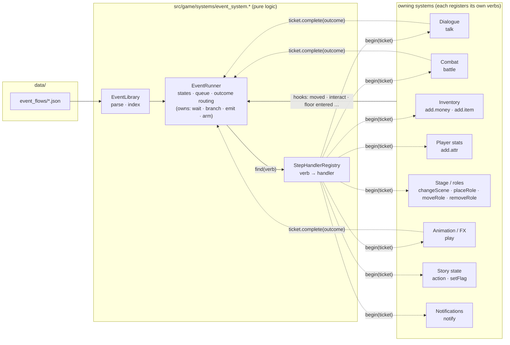

# 02 — Binding the Event System to the Game

Part of the [Event System](README.md) design. [01](01_CONCEPTS_AND_DATA_SCHEMA.md) defines the data;
this doc defines **the runtime**, **how game systems plug into it**, and **how today's hard-coded
events migrate onto it**.

---

## 1. Principle: the runner routes, the owning system handles

The Event System does **not** know how to talk, fight, give items or move the camera. It knows only
**flow control**: which events are armed, which trigger matched, which step comes next, and where
an outcome routes. Every step or fire verb that does real game work is **handled by the system
that owns that work**:

- the **dialogue system** handles `talk`
- the **combat system** handles `battle`
- the **inventory system** handles `add` money/item
- the **stage system** handles `changeScene` and `placeRole`
- and so on (full table in §3)

Each owning system **registers a handler** for its own verbs. The runner looks up the verb, passes
the step's JSON to that handler, and waits until the handler reports an outcome.



Why this split:

| Concern | With one central "host" interface (rejected) | With per-system handlers (this design) |
|---|---|---|
| Adding a step type | edit the central interface, the game adapter, the simulator adapter and the mock | add one handler inside the owning system; the runner does not change |
| Who knows a `talk` outcome | the adapter has to reach into dialogue internals to find out | the dialogue system, which already knows which choice was taken |
| Validating step data (does this dialogue node exist?) | the central validator has to know every system's data | each system validates its own verbs (§2.3) |
| Code ownership | one file every feature touches | each system's handler sits next to that system's code |

The runtime still has **no `#include "game.h"`**. Handlers depend on the runner's small interface,
not the other way round. That keeps `event_system_test.cpp` headless, and it lets the editor's
simulator plug in its own handlers ([04](04_FLOW_PREVIEW.md)).

## 2. Runtime contract

### 2.1 Handler interface

```cpp
// src/game/systems/event_system.h  (sketch)
namespace toms {

// Identifies one running step. Held by the owning system while a blocking step is in progress;
// it is the ONLY way back into the runner. Move-only. A ticket from an event that was aborted or
// already completed is stale: complete() on it is a no-op (logged), so a dialogue the player opened
// on their own, or a late callback after a floor change, can never advance the wrong event.
class StepTicket {
public:
    const nlohmann::json& step() const;        // this step's JSON, exactly as authored
    const std::string&    flowId() const;
    const std::string&    eventId() const;
    bool valid() const;
    void complete(const std::string& outcome = "done");   // "done" | "win" | "lose" | "choice:<id>" | …
};

enum class StepStart {
    Completed,  // instant verb: work is done and ticket.complete() was already called inside begin()
    Pending,    // blocking verb: the system keeps the ticket and completes it later
    Rejected,   // cannot run now (bad data at runtime, system busy): the event fails closed, logged
};

class IStepHandler {
public:
    virtual ~IStepHandler() = default;
    virtual const char* owner() const = 0;                  // "dialogue", "combat"… for logs / editor
    virtual std::vector<std::string> verbs() const = 0;     // e.g. {"talk"} or {"add.money","add.item"}
    virtual StepStart begin(StepTicket ticket) = 0;
    // A save made while this step was Pending is loaded: start the step again (default = begin()).
    virtual StepStart resume(StepTicket ticket) { return begin(std::move(ticket)); }
    // The runner is abandoning a Pending step (flow disarmed, run reset). Drop the ticket, close UI.
    virtual void abort(const StepTicket&) {}
};

class StepHandlerRegistry {
public:
    // Exactly ONE owner per verb. Registering a verb twice is a startup error, not "last one wins":
    // unlike the EventBus (many listeners), a step must have one system responsible for it.
    bool add(IStepHandler& h, std::string* error);
    IStepHandler* find(const std::string& verb) const;
    std::vector<std::string> verbs() const;                 // for the validator / editor palette
};
}
```

**Verb key.** A step's verb is its `type`. For `add` it is `type.what` (`add.money`, `add.item`,
`add.attr`), because money, items and stats belong to different systems. Fire outputs use the same
registry (`placeRole`, `moveRole`, `removeRole`), but a fire handler must return `Completed`, since
fire outputs never block.

**Verbs the runner keeps for itself**, because they are flow control rather than game work:
`wait`, `branch`, `emit`, `arm`, `disarm`, `next`. They are not in the registry and cannot be
overridden.

### 2.2 Runner

```cpp
enum class EvState { Dormant, Armed, Running, Done, Failed };
struct EventProgress { EvState state = EvState::Dormant; int stepIndex = 0; int runs = 0; };
struct FlowProgress  { bool active = false; std::map<std::string, EventProgress> events; };

class EventLibrary {                      // parsed, immutable; loaded once in loadAssets()
public:
    bool loadDir(const std::string& dir, const StepHandlerRegistry&, std::vector<std::string>* errors);
    const FlowDef* flow(const std::string& id) const;
    // indexes: (on, floor) -> events   ·   signal -> events
};

// Answers "where is marker m_crypt_altar on F33?" for approach/interact triggers. Implemented by the
// stage system (it owns markers and entities), not by the runner.
class ITargetResolver {
public:
    virtual ~ITargetResolver() = default;
    virtual bool resolve(const std::string& floor, const nlohmann::json& at, int& x, int& y) const = 0;
    virtual bool entityMatches(const std::string& floor, const Entity& e, const nlohmann::json& trigger) const = 0;
};

class EventRunner {
public:
    EventRunner(const EventLibrary&, const StepHandlerRegistry&, const ITargetResolver&,
                const ConditionContextProvider&);

    // ---- hooks: systems report what just happened (§4)
    void onEnterFloor(const std::string& floor, StageArrival arrival);
    void onExitFloor(const std::string& floor, int dir);
    void onPlayerMoved(const std::string& floor, int x, int y);
    bool onInteract(const std::string& floor, const Entity& target);   // true = an event claimed it
    void onBusEvent(const EnemyDefeated&); void onBusEvent(const ItemCollected&); void onBusEvent(const ChoiceMade&);
    void onStateChanged();                                            // re-check `condition` triggers
    void tick(int dtMs);                                              // `wait` steps, queued triggers

    bool busy() const;                                                // an event is Running
    void writeInto(RunSaveData&) const;  void readFrom(const RunSaveData&);
    void writeInto(MetaSaveData&) const; void readFrom(const MetaSaveData&);
    const std::map<std::string, FlowProgress>& progress() const;
    std::function<void(const TraceEntry&)> onTrace;                   // timeline for 04
};
```

`ConditionContextProvider` returns a fresh `GameConditionContext(pl, meta_, missionTrackers_, run_,
equipped_)` at call time, because that context holds references to live state (see
[`game_condition.h`](../../src/game/core/game_condition.h)).

### 2.3 Each system owns its verb's data contract

A handler class depends on live game state, so the editor and `tools/validate_events.py` cannot link
it. Each owning system therefore also ships two **pure** pieces for each verb it registers:

1. **A step schema**, `data/event_flows/_schema/<verb>.json`. It lists the verb's fields, their
   kinds (`dialogueId`, `enemyId`, `itemId`, `marker`, `int`, …), required/optional status, the
   verb's **possible outcomes**, and whether the verb blocks.

   ```json
   { "verb": "battle", "owner": "combat", "blocking": true,
     "fields": { "enemy": { "kind": "enemyId", "required": true },
                 "boss":  { "kind": "bool" }, "entity": { "kind": "roleId" }, "allowFlee": { "kind": "bool" } },
     "outcomes": ["win", "lose"] }
   ```

2. **A validate function** in the system's pure-logic code, for checks a schema cannot express
   (for example, "this `node` exists in that dialogue file", or "`boss: true` only on a boss floor").
   It takes the step and a read-only `DataCatalog`, and it must not touch live state.

The editor builds its inspector and step palette from these schemas ([03 §4](03_EVENT_EDITOR.md#4-inspector-widgets-per-field)).
The path explorer branches on each schema's `outcomes` ([04 §4](04_FLOW_PREVIEW.md#4-path-explorer)).
`EventLibrary::loadDir()` rejects a flow that uses a verb no system registered. As a result, **adding
a new step type never requires touching the runner, editor or validator code**, only the owning system.

## 3. Who owns what

Today these "systems" are mostly `Game` member functions split across files, not separate classes.
Each handler is therefore a small class **in the owning system's file**. It holds only the state it
needs. When a system is later extracted into its own class (for example a `DialogueSystem`), its
handler moves with it and the runner does not change.

| Verb(s) | Owning system | Handler lives in | Wraps existing code | Blocks? · outcomes |
|---|---|---|---|---|
| `talk` | Dialogue | [`game_story.cpp`](../../src/game/core/game_story.cpp) `DialogueStepHandler` | `startDialogue()`, `enterNode(node)`, plus a new single `endDialogue()` close path | yes · `done`, `choice:<optionId>` |
| `battle` | Combat | [`game_combat.cpp`](../../src/game/core/game_combat.cpp) `CombatStepHandler` | `startCombat()` / `engageMonster(e)`; completes from `finishCombatWin()` / `finishCombatLose()` | yes · `win`, `lose` |
| `add.money`, `add.item` | Inventory | [`game_inventory.cpp`](../../src/game/core/game_inventory.cpp) `InventoryStepHandler` | `applyItem()` / `pl.inv`, via a new `grantItem()` shared with the `item:` pickup branch of `movePlayer()` | no |
| `add.attr` | Player stats | `game_inventory.cpp` (next to `applyItem`'s stat effects) `StatStepHandler` | `pl.*` fields; counters through `RunStoryState::addCounter` (clamped) | no |
| `changeScene`, `placeRole`, `moveRole`, `removeRole` (+ `ITargetResolver`) | Stage / roles | [`game_assets.cpp`](../../src/game/core/game_assets.cpp) `StageStepHandler` | `requestStageTransition()` / `loadStage()`, `st.entities` / `st.tiles`, `setEntityStatus()`; new `markers` map in `parseStage()` | `changeScene` ends the event · others no |
| `play` | Animation / FX | [`game_scene_draw.cpp`](../../src/game/core/game_scene_draw.cpp) `FxStepHandler` | sprite animation / shake / camera pan, `audio.play()` for `sfx` | if `wait: true` · `done` |
| `action`, `setFlag` | Story state | `game_story.cpp` `StoryStepHandler` | `runDialogueAction()` (unchanged verb switch), `run_.setFlag()` / `setStoryFlag()` | no |
| `notify` | Notifications (UI) | `game_story.cpp` next to `pushNotification()` | `notifications_.push_back()` | no |
| `wait`, `branch`, `emit`, `arm`, `disarm`, `next` | **EventRunner** | `event_system.cpp` | — | `wait` only |

Registration happens once, in `Game::loadAssets()`, **before** `eventLib_.loadDir()` so the library
can check verbs:

```cpp
// game_assets.cpp — Game::loadAssets()
eventHandlers_.add(dialogueStepHandler_, &err);   // each system adds itself; order does not matter
eventHandlers_.add(combatStepHandler_,   &err);
eventHandlers_.add(inventoryStepHandler_,&err);
// …
eventLib_.loadDir(dataDir + "/../data/event_flows", eventHandlers_, &errors);
```

### 3.1 Example: the dialogue system's handler

The same pattern applies to every blocking verb. The system keeps the ticket, runs its normal code,
and completes the ticket from its own "finished" point with the outcome **it** knows:

```cpp
// game_story.cpp
class DialogueStepHandler : public toms::IStepHandler {
public:
    explicit DialogueStepHandler(Game& g) : g_(g) {}
    const char* owner() const override { return "dialogue"; }
    std::vector<std::string> verbs() const override { return {"talk"}; }
    toms::StepStart begin(toms::StepTicket t) override {
        const auto& s = t.step();
        if (g_.inDialogue) return toms::StepStart::Rejected;             // one conversation at a time
        g_.startDialogue(s.value("dialogue", ""));                        // existing entry point
        std::string node = s.value("node", "");
        if (g_.inDialogue && !node.empty()) { g_.dlgNode = node; g_.enterNode(node); }   // node overrides "start"
        if (!g_.inDialogue) return toms::StepStart::Rejected;           // missing file/node: fail closed
        pending_ = std::move(t);
        lastChoiceOption_.clear();
        return toms::StepStart::Pending;
    }
    void abort(const toms::StepTicket&) override { pending_ = {}; g_.endDialogue(); }
    // --- called from dialogue code, not from the runner:
    void noteChoice(const std::string& optionId) { lastChoiceOption_ = optionId; }   // from the makeChoice action
    void onDialogueClosed() {                                                        // from Game::endDialogue()
        if (!pending_.valid()) return;              // player-initiated dialogue: nothing to report
        auto t = std::move(pending_);
        t.complete(lastChoiceOption_.empty() ? "done" : "choice:" + lastChoiceOption_);
    }
private:
    Game& g_;
    toms::StepTicket pending_;
    std::string lastChoiceOption_;
};
```

## 4. Hook points: how triggers get in

Triggers flow in the other direction: the system where something happens **reports it** to the
runner. Every hook is **one added line** at a place that already exists. None of them changes
existing behavior until a flow actually matches.

| Trigger (`on`) | Reported by · file · function | Call |
|---|---|---|
| `enterFloor` | Stage: [`game_assets.cpp`](../../src/game/core/game_assets.cpp) end of `Game::loadStage()`, after entities, `entityStatus_`, placed roles (§6) and `applyChapterGrants()` | `events_.onEnterFloor(curStage, arrival)` |
| `exitFloor` | Stage: [`game.cpp`](../../src/game/core/game.cpp) `confirmStageTransition()` before `loadStage()` | `events_.onExitFloor(curStage, isUp ? +1 : -1)` |
| `approach` | Movement: [`game_input.cpp`](../../src/game/core/game_input.cpp) `Game::movePlayer()` after `pl.x = nx; pl.y = ny; advanceRoamers();`, **before** the entity scan | `events_.onPlayerMoved(curStage, nx, ny); if (events_.busy()) return;` |
| `interact` | Movement: `Game::interact()` and the `npc:` branch of `movePlayer()`, before the hard-coded NPC→dialogue map | `if (events_.onInteract(curStage, e)) return;` (the old map remains the fallback) |
| `pickup` / `defeat` / `choice` | EventBus: `ItemCollected` / `EnemyDefeated` / `ChoiceMade`, subscribed next to `wireMissionEvents()` | `globalEventBus().subscribe<…>([this](auto& e){ events_.onBusEvent(e); });` ×3 |
| `condition` | any system after it changes state (`runDialogueAction()`, `finishCombatWin/Lose()`), and the runner after every instant step | `events_.onStateChanged()` |
| `wait` / queue | Frame loop: [`game.cpp`](../../src/game/core/game.cpp) `Game::update(dtMs)` | `events_.tick(dtMs)` |

`Game` owns `eventHandlers_` (the registry), `eventLib_`, `events_` and the handler objects. A flow
that fails to load is skipped and logged through `log.h` (fail closed: the game still runs).

**Modal interaction.** `Game::modalActive()` already blocks world input while combat, dialogue or
inventory is open. Add `|| events_.busy()` so the player cannot walk away mid-cut-scene, including
during `wait` steps between a dialogue and a battle.

## 5. The run loop

Only **one event runs at a time**. That is the simplest rule that keeps "a dialogue opens a battle,
which opens a dialogue" deterministic. Triggers that match while the runner is busy go into a FIFO
queue. They are re-checked (including `requires`) when the running event ends.

```mermaid
sequenceDiagram
    autonumber
    participant P as Player
    participant M as Movement (movePlayer)
    participant R as EventRunner
    participant C as Combat handler
    participant I as Inventory / Stats / Story handlers
    participant S as Stage handler

    P->>M: step onto (7,18) on F33
    M->>R: onPlayerMoved("F33", 7, 18)
    R->>R: ev_fight_choir Armed, requires true -> Running, step 0
    R->>C: registry.find("battle")->begin(ticket)
    C->>C: startCombat(wraith), keep ticket
    C-->>R: Pending  (busy() -> modalActive())
    Note over C: combat plays out in the combat system
    C->>R: finishCombatWin() -> ticket.complete("win")
    R->>R: onOutcome["win"] = continue -> step 1
    R->>I: begin(add.money) · begin(add.item) · begin(add.attr) · begin(setFlag)
    I-->>R: Completed ×4
    R->>R: last step -> Done -> fire[]
    R->>S: begin(removeRole r_ghost) · begin(placeRole … F35)
    S-->>R: Completed (F35 change stored until F35 loads)
    R->>R: emit "choir_silenced" -> queue signal triggers; publish EventSignal on EventBus
    R->>R: arm ev_ghost_thanks
```

Where each blocking verb completes. **The owning system decides**, not the runner:

| Verb | Completed from | Outcome |
|---|---|---|
| `talk` | `Game::endDialogue()`, a new single close path. Today `inDialogue = false` is set inline in ~10 places across `game.cpp`, `game.h`, `game_input.cpp`, `game_store.cpp`, `game_story.cpp` and `game_title_glue.cpp`, and they must all route through it | `choice:<optionId>` of the last `makeChoice` in that conversation, else `done` |
| `battle` | end of `finishCombatWin()` / `finishCombatLose()` | `win` / `lose` |
| `play` (`wait: true`) | the FX system when the clip ends (until an animation system exists: a timer in `FxStepHandler` using the clip's `durationMs`) | `done` |
| `wait` | `EventRunner::tick()` | `done` |

**Special cases, decided up front:**

- *`battle` lost with default routing*: `finishCombatLose()` already reloads the floor (respawn).
  The combat handler completes the ticket with `lose` **before** calling that reload, so the reload's
  `onEnterFloor` sees the event already `Failed`.
- *`changeScene`*: the stage handler returns `Completed` and asks the runner to finish the event
  (Done + `fire`) **before** it starts the transition. Nothing in the old floor's context runs after
  the unload.
- *A boss win that jumps to `stage_11`* (`finishCombatWin` → `loadStage("stage_11")`): same rule.
  The combat handler completes first, then the jump happens.

## 6. Save / load

Each part of the state is saved **by the system that owns it**:

| State | Owner | Stored in |
|---|---|---|
| Flow/event progress (state, step index, run count) | EventRunner | `RunSaveData::eventFlows` (scope `run`) / `MetaSaveData::eventFlows` (scope `meta`) |
| Roles placed/moved by events | Stage system | `RunSaveData::placedRoles`, next to the existing `entityStatus` it already owns; re-applied in `loadStage()` |
| Items, gold, stats, flags, counters | Their existing owners | unchanged fields (`player`, `flags`, `counters`, …) |

```json
"eventFlows": {
  "flow_ss05_crypt_choir": {
    "active": true,
    "events": { "ev_hear_choir": { "s": "done", "runs": 1 }, "ev_fight_choir": { "s": "running", "step": 0 } }
  }
},
"placedRoles": {
  "F33": [ { "id": "r_ghost", "role": "npc:ghost_villager", "x": 8, "y": 18, "by": "flow_ss05_crypt_choir/ev_hear_choir" } ]
}
```

- Stored as JSON, so a flow schema change never needs a save `schemaVersion` bump. Unknown
  flows/events in a save are dropped with a log line. Events missing from a save start from their
  definition, so **new content appears in old saves automatically**.
- **Mid-event saves resume at the step boundary.** A `running` event saves its `step`. On load the
  runner calls that verb's handler `resume()`. The dialogue system re-opens the conversation and the
  combat system restarts the fight. Instant steps before it are not re-applied.
  `markProgressDirty()` is called after every step.
- Rebirth (`RunStoryState::reset`) clears `run` flows and `placedRoles`, and keeps `meta` flows.

## 7. Migration plan

Each phase ships on its own and leaves the game playable.

| Phase | Work | Visible change |
|---|---|---|
| **E0** | `event_system.h/.cpp` (runner, registry, library) + `event_system_test.cpp` using **test handlers** (outcome routing, queueing, stale tickets, duplicate-verb rejection, save round-trip). `tools/validate_events.py` reading `_schema/*.json`. | none |
| **E1** | Hooks (§4). The handlers for `talk`, `battle`, `add.*`, `notify`, `setFlag`, `action` in their own systems, plus their schemas. `endDialogue()` single close path. Save fields. `data/event_flows/` ships with **one** flow. | one new side-story beat |
| **E2** | Stage handler (`placeRole`/`moveRole`/`removeRole`/`changeScene`, markers, `ITargetResolver`). **NPC routing moves to data**: the hard-coded `villager → villager_elder …` if/else becomes one tiny flow per NPC (`interact` → `talk`, `repeat: true`). The C++ map stays one release as the fallback. | none (same dialogues) |
| **E3** | **Floor event tiles**: the id-string guessing in `movePlayer()`'s `event:` branch is replaced by a `steps` list on each pool entry in `data/events/pool_*.json`, run through the same runner and handlers. `gen_floors.py` / `gen_story_i18n.py` write explicit steps. | same effects, now authored |
| **E4** | FX handler (`play`). `sideStoryHooks` in `data/story/floors/*.json` converted into flows. Missions subscribe to `EventSignal`. | side stories become live |
| **E5** | Editor + simulator ([03](03_EVENT_EDITOR.md), [04](04_FLOW_PREVIEW.md)). Can start in parallel with E1 once E0 exists. | tooling |

## 8. Testing

- `event_system_test.cpp` (headless, same style as `condition_eval_test.cpp`): scripted **test
  handlers** register the verbs, record `begin`/`abort` calls, and complete tickets on demand. Tests
  assert the call log and progress. The runner's own verbs (`wait`, `branch`, `emit`, `arm`) are
  tested with no game systems at all.
- **Each system tests its own handler** in that system's test file (for example, a dialogue test
  checks that `talk` completes with `choice:opt_help` after that choice). The runner test never
  needs to know how dialogue works.
- **Golden traces**: the path explorer ([04 §4](04_FLOW_PREVIEW.md#4-path-explorer)) writes every
  flow's paths to `build/event_traces/<flow>.txt`, and CI diffs them.
- `tools/validate_events.py` runs in CI next to `tools/validate_story.py`, with zero errors required.
