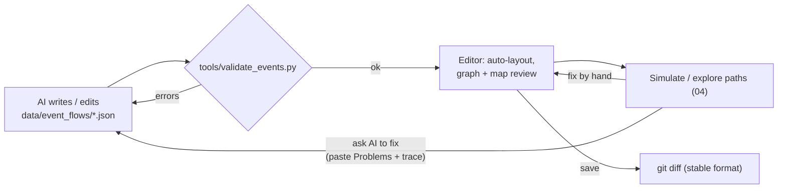

# 03 — Event Editor

Part of the [Event System](README.md) design. This doc describes how the editor authors and
reviews flows. [04](04_FLOW_PREVIEW.md) covers how it previews and simulates them.

---

## 1. Where it lives

The event editor is a **new mode inside the existing Qt6 editor** (`editor/`, `tower_editor`), not a
separate app. It reuses the editor's build setup (Qt6 Widgets, `CMAKE_AUTOMOC`), its stage canvas
(`StageScene`) for map binding, and its headless-validation pattern (`editor_validate.cpp`).

```
editor/src/
  mainwindow.*            + "Stage | Events" mode switch (tab bar at the top)
  event/
    flowmodel.h/.cpp      FlowDoc: load/save one flow JSON, undo stack, keeps unknown keys
    catalogs.h/.cpp       id pickers loaded from data/: items, enemies, dialogues(+nodes), floors, markers, anims, flags, counters
    flowgraphscene.*      QGraphicsScene: event nodes, step lists, edges
    flowinspector.*       property panel for the selected event / step / fire output
    mapbinding.*          StageScene overlay: trigger zones, markers, placed roles
    validatorpanel.*      live error/warning list (same rules as tools/validate_events.py)
    simulator/*           see 04 — links src/game/systems/event_system.cpp
```

`editor/CMakeLists.txt` adds `../src/game/systems/event_system.cpp`, `../src/engine/condition.cpp`
and `external/json` to the editor target. The editor and the game then **parse, validate and run
flows with the same code**.

## 2. Screen layout

```
┌───────────────────────────────────────────────────────────────────────────────────────────────┐
│ [Stage] [Events]    Flow: flow_ss05_crypt_choir ▾   ● modified   ▶ Simulate   ⤢ Overview   ✔ 0 ⚠ 2 │
├──────────────┬─────────────────────────────────────────────────────┬──────────────────────────┤
│ FLOWS        │  GRAPH                                              │ INSPECTOR                │
│ ▸ ch_01      │                                                     │ Event  ev_fight_choir    │
│   flow_npc_* │  ┌─────────────┐     ┌──────────────┐               │ ─────────────────────── │
│ ▾ ch_05      │  │⚑ hear_choir │────▶│💬 talk_ghost │──opt_help──┐  │ Trigger  [approach  ▾]   │
│   ss05_choir │  │ approach r2 │     │ interact npc │            │  │  Floor   [F33 ▾]         │
│   ss05_…     │  │ ▸ play mist │     │ ▸ talk       │            ▼  │  Target  (•)marker ( )cell│
│              │  │ ▸ notify    │     │ ▸ action     │   ┌──────────────┐ │   [m_crypt_altar ▾] 🗺  │
│ SIGNALS      │  │ ⇢ placeRole │     └──────┬───────┘   │⚔ fight_choir │ │  Radius  [0]            │
│  choir_…  ↔  │  └─────────────┘   refuse  │ (failed)  │ ▸ battle     │ │ Requires  (none) [+]    │
│              │                            ▼           │ ▸ add money  │ │ Once [✔]  Repeat [ ]    │
│ SEARCH       │                ╭╌╌╌╌╌╌╌╌╌╌╌╌╌╌╮        │ ▸ add item   │ │ ─────────────────────── │
│ [_________] │                ┆ ⚡ choir_ignored┆        │ ▸ add attr   │ │ Steps              [+▾] │
│              │                ╰╌╌╌╌╌╌╌╌╌╌╌╌╌╌╯        │ ⇢ emit …     │ │  1 ⚔ battle wraith  ⋮   │
│              │                                        └──────┬───────┘ │    win → continue       │
│              │                                  lose (retry) ↺       │ │    lose → failed +arm ↺ │
├──────────────┴─────────────────────────────────────────────────────┤  2 💰 money +60        ⋮ │
│ MAP  F33  [✔ triggers] [✔ markers] [✔ placed roles]                 │  3 🎒 item potion_blue×1 │
│ ###################                                                  │  4 ✦ attr humanity +1   │
│ #.....░░░.........#   ░ = approach zone of the selected event        │ Fire                [+▾] │
│ #.....░A░..g......#   A = marker m_crypt_altar  g = placed r_ghost   │  ⇢ removeRole r_ghost   │
│ #.....░░░.........#                                                  │  ⇢ placeRole … @F35     │
├──────────────────────────────────────────────────────────────────────┤  ⚡ emit choir_silenced  │
│ PROBLEMS  ⚠ ev_ghost_thanks: dialogue node 'choir_thanks' not found in ghost_villager.json     │
│           ⚠ signal 'choir_ignored' is emitted but nothing listens                             │
└───────────────────────────────────────────────────────────────────────────────────────────────┘
```

| Pane | Purpose |
|---|---|
| **Flows** | Every file in `data/event_flows/`, grouped by the flow's first floor's act. It also lists the signal catalog (every signal name, with emit/listen counts) and a search box (id, text key, dialogue, enemy, item). |
| **Graph** | One **node per event**, with a header showing the trigger icon and a compact step list. Edges are explained in §3. |
| **Inspector** | Edits the selection with **typed widgets and pickers**, never free-text ids (§4). |
| **Map** | The floor the selected event touches, drawn with the existing `StageScene`, plus overlays (§5). |
| **Problems** | Live validator output. Clicking a row selects the offending node/field. |

## 3. Graph conventions

| Visual | Meaning |
|---|---|
| Node header icon | Trigger kind: ⚑ approach, 💬 interact, ✋ pickup, ☠ defeat, ⇥ enterFloor, ⚡ signal, ❓ condition, ▶ immediate |
| Node badge `A` | `armed: true` (an entry point of the flow) |
| Node rows `▸` | Steps, in order, one line each (`▸ battle wraith`). Rows with outcome routing show a port on the right edge. |
| Node rows `⇢` | Fire outputs |
| **Solid edge** | `next` / `arm`: "progress goes to this event" |
| **Labelled edge from a step port** | Outcome routing (`win`, `lose`, `choice:opt_help`). A red edge is an `end: failed` path. |
| **Dashed edge through a ⚡ pill** | `emit` → `signal` trigger. It goes to a node in this flow or to a **ghost node** that stands for an event in another flow (double-click opens that flow). |
| ↺ | A self-edge (re-arm / retry) |
| Dimmed node | Unreachable (validator warning) |

Editing actions:

- **Create**: right-click on empty canvas opens *New event ▸ [trigger kind]*. Dragging from a node's
  right edge to empty space creates a new event already linked through `next`.
- **Connect**: drag from a node or step port onto another node to add `next` / an outcome `arm`.
  Dragging onto a ⚡ pill adds an `emit` / `signal` pair (it asks for the signal name, with
  autocomplete from the signal catalog).
- **Steps**: reorder with drag or Alt+↑/↓ in the inspector. Duplicate with Ctrl+D. The `+▾` menus
  offer only the valid types (for example, nothing after `changeScene`).
- **Undo/redo** for every edit (`QUndoStack`). **Auto-layout** (left→right, layered) for flows
  that arrive without `_editor.nodes`, which is every AI-generated flow.

## 4. Inspector widgets per field

The editor has **no hard-coded knowledge of step types**. The step palette, each step's form and
each step's outcome ports are generated from the owning systems' schemas in
`data/event_flows/_schema/<verb>.json` ([02 §2.3](02_GAME_INTEGRATION.md#23-each-system-owns-its-verbs-data-contract)).
The palette groups verbs by `owner` (Dialogue, Combat, Inventory, Stage, …). When a system adds a
verb and its schema, the editor shows it with no editor code change. The schema's field `kind`
picks the widget:

| Field kind | Widget | Source of choices |
|---|---|---|
| `dialogue`, `node` | combo + "open" button (opens the dialogue JSON in the system editor) | `data/dialogue/*.json`, then its `nodes` keys |
| `enemy` | combo with a sprite thumbnail and HP/ATK/DEF | `data/enemies.json` + `assets/sprites/` |
| `itemId` | combo with icon | `data/items.json`, `data/equipment.json` |
| `attr` | combo | fixed stats + `data/story/counters.json` |
| `floor` | combo | `data/stages/*.json`, `data/story/floors/*.stage.json` |
| target `marker` / `cell` | combo + 🗺 **pick on map** (click a cell in the Map pane) | the floor's `markers`. "New marker here…" writes the marker into the stage file through the Stage mode's model |
| `requires`, `if`, `when` | **condition builder**: a tree of `all`/`any`/`not` plus leaf rows, with a raw-JSON toggle | leaf types from `condition.h`, ids from `flags.json`, missions, choices |
| `text` keys | key field + live preview of `zh_TW` / `en` text; "create key" writes `data/text.json` | `data/text.json` + i18n tables |
| `anim` | combo + inline preview of the sprite animation | art manifest |

Anything the editor does not recognize (a future field, AI extras) is shown as a read-only
"Other fields" JSON block and **written back unchanged**.

## 5. Map binding

The Map pane is the regular stage canvas with extra layers:

- **Trigger zones**: `approach` radius drawn as a tinted square around the target, and `interact`
  targets outlined. The selected event is highlighted; other armed events are faint.
- **Markers**: shown as labelled pins. They can be dragged to move them (this updates the stage file).
- **Placed roles**: ghost sprites for every `placeRole` in the flow that targets this floor, with a
  tooltip naming the event that places or removes each one.
- Selecting a node in the graph ⇄ selecting its zone on the map is two-way. Clicking a tile opens
  "events touching this cell", which is the question "what happens if I step here?".

On **generated** floors (`tools/gen_floors.py` output) the pane shows a banner: *"This floor is
regenerated — bind to a marker."* Placing a raw `cell` target shows a validator warning
([01 §8](01_CONCEPTS_AND_DATA_SCHEMA.md#8-validation-rules-enforced-by-toolsvalidate_eventspy-and-the-editor)).

## 6. Save format and the AI round-trip

Events in this project are written by AI, so the editor is designed as a **reviewer of
AI-generated JSON** as much as an authoring tool:



Rules that keep this loop clean:

1. **Stable output**: 2-space indent, the key order from the schema (unknown keys keep their
   original position), and arrays kept one item per line. An editor save of an unchanged file
   produces **zero diff**. Like `editor_validate.cpp`'s stage round-trip, a headless test
   (`event_editor_validate`) loads every flow, saves it and checks byte equality.
2. **Layout lives only in `_editor`**. A human dragging nodes never touches game-relevant keys, so
   AI edits and human layout edits merge cleanly.
3. **"Copy for AI"** (toolbar): copies the flow JSON, the current Problems list and the last
   simulator trace to the clipboard as one prompt-ready block.
4. **Hot reload**: the editor watches `data/event_flows/` (`QFileSystemWatcher`). When AI rewrites a
   file while it is open, the editor reloads it, keeps the layout of nodes whose ids survived, and
   shows a diff badge on changed nodes.

## 7. Headless mode

As with `tower_editor --shot stage01.json out.png`, the editor can run without a window:

```
tower_editor --events-validate data/event_flows            # same as validate_events.py, exit code = error count
tower_editor --events-shot flow_ss05_crypt_choir out.png   # render the graph to PNG (for PRs / docs)
tower_editor --events-explore flow_ss05_crypt_choir out.txt  # path explorer report (04 §4)
```
