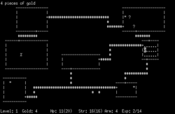
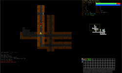

# TOMS Roguelike 化玩法提案

> 目標：把 TOMS 從傳統迷宮 / 關卡式流程，改造成「固定邏輯設計、隨機迷宮、商店養成、技能樹、Boss 分層」的 roguelike 主循環。

## 1. 設計目標

- 保留 TOMS 原本的背包、道具、角色狀態與戰鬥系統。
- 新增「每次進場都不一樣」的重玩性。
- 把關卡內容拆成可組合模組：`Stage -> N 層迷宮 -> 商店 -> Boss -> 結算`。
- 讓玩家在每一輪都要做選擇：走哪個 stage、升哪個 skill、買哪個道具、要不要挑戰更高難度。

Roguelike 典型特徵包含程序化生成關卡、回合制、格狀移動與角色永久死亡；這些特徵很適合拿來做「高重玩性 + 低製作成本」的關卡結構。[1]

## 2. 核心遊戲循環

### 2.1 大循環

1. 進入主城 / 地圖
2. 選擇要玩的 Stage
3. 進入該 Stage 的第 1 層迷宮
4. 清怪、開箱、拿資源
5. 進入商店或事件房
6. 升級技能 / 購買道具 / 調整 Build
7. 挑戰 Boss
8. 完成後進入下一層或結算

### 2.2 一輪遊玩結構

- **Stage 選擇**：玩家先選地圖主題、難度、報酬類型。
- **Layer 結構**：每個 Stage 有 `N` 層 maze，例如 3 / 5 / 7 層。
- **Boss 數量**：依難度不同，每個 Stage 配置 1～3 個 Boss。
  - Easy：1 Boss
  - Normal：2 Boss
  - Hard：3 Boss
- **中繼節點**：在某些層後固定出現商店或事件房，讓玩家補給與重建 Build。

## 3. 迷宮系統：必須採用 Wilson’s Algorithm

迷宮生成不只是「畫牆」，而是要做成可控、可重播、可調難度的內容生成器。迷宮生成常被視為在圖上生成一棵隨機 spanning tree；Wilson 演算法則是用 loop-erased random walk 來構造 uniform spanning tree，這代表它很適合做「公平、無明顯偏差、每張圖都像真的迷宮」的生成器。[2][3]

### 3.1 為什麼適合 TOMS

- **每次地圖都不同**：增加重玩性。
- **不容易出現明顯偏路偏牆**：比某些簡單 DFS / Prim 版本更適合作為主系統。
- **容易接 Boss 房、寶箱房、商店房**：可把樹狀結構再加節點規則。
- **容易做難度調整**：只要改房間密度、分支數、死路比率、特殊房間數量。

### 3.2 在專案中的定位

建議把迷宮生成器做成獨立模組：

- `MazeGenerator`
- `StageLayoutBuilder`
- `RoomTemplateSystem`
- `EncounterPlacer`

其中 Wilson’s Algorithm 負責「骨架迷宮」，再由 `StageLayoutBuilder` 疊加：

- 起點 / 終點
- 商店房
- Boss 房
- 事件房
- 寶箱房
- 祭壇 / 技能房

## 4. 技能系統：技能樹 + 局內升級

技能系統建議分成兩層：

### 4.1 局外技能樹（Meta Progression）

這層是長期成長，玩家每次通關或累積資源後解鎖。

建議分支：

- **戰鬥系**：增加攻擊、暴擊、破甲、連段上限
- **生存系**：HP、護盾、回復、減傷
- **探索系**：看見更大地圖、揭露商店、降低陷阱傷害
- **經濟系**：更多金幣、折扣、重抽次數
- **迷宮系**：更高機率出現寶箱、秘密房、捷徑

### 4.2 局內技能升級（Run Upgrade）

這層是單次遊戲內的 Build 變化，來源可以是：

- 清怪獎勵
- Boss 獎勵
- 商店購買
- 隨機事件

每次升級只提供 2～4 個選項，玩家做選擇，而不是單純加數值。

## 5. 商店系統：不是補血而已，而是 Build 設計核心

商店應該是每輪遊戲的戰略節點，而不是單純買藥水。

### 5.1 商店售賣內容

- 武器 / 防具 / 消耗品
- 被動技能卡
- 主動技能卡
- 迷宮工具：開圖、傳送、炸牆、鑰匙、陷阱探測
- Build 修正道具：洗點、重抽、合成、升階

### 5.2 商店的節奏

- Easy 難度：商店較多，讓玩家熟悉 build。
- Normal 難度：商店數量中等，讓資源管理變重要。
- Hard 難度：商店稀少，但商品更強，迫使玩家做風險判斷。

### 5.3 商店的角色

商店要做成「風險控制器」：

- 補足角色短板
- 讓 Build 朝特定方向收斂
- 給玩家放棄 / 投資 / 轉型的機會

## 6. Stage 選擇系統

主城或世界地圖應該提供「選 Stage」而不是單線推關。

### 6.1 每個 Stage 顯示資訊

- 推薦等級
- 難度標籤
- 主要掉落類型
- Boss 數量
- 迷宮風格（狹窄 / 多分支 / 事件多 / 戰鬥密集）

### 6.2 Stage 範例

- **廢墟迷宮**：怪少、寶箱多、適合新手
- **熔岩深層**：路窄、傷害高、Boss 強
- **古代學院**：事件多、技能書多、商店強
- **黑暗城塞**：Boss 1～3 階段戰，偏高難度

## 7. Boss 設計：與迷宮層數綁定

Boss 不只是最後一隻怪，而是 Stage 結構的一部分。

### 7.1 Boss 數量與難度

- **Easy**：1 個 Boss，偏教學
- **Normal**：2 個 Boss，第一個偏機制、第二個偏壓力
- **Hard**：3 個 Boss，分別對應前、中、後段，形成完整考驗

### 7.2 Boss 與迷宮的互動

Boss 可以改變迷宮規則：

- 關閉部分門
- 召喚追擊怪
- 改變視野範圍
- 生成臨時分岔路
- 觸發倒計時逃脫房

## 8. 參考圖片 / 視覺靈感

### 8.1 Wilson 迷宮生成示意


*圖 1：Wilson’s algorithm / loop-erased random walk 生成迷宮的概念示意。[2][3]*

### 8.2 經典 roguelike 截圖



*圖 2：早期 roguelike《Rogue》的程序化地牢視覺參考。[1]*

### 8.3 現代 roguelike 風格截圖



*圖 3：較現代的 roguelike 介面與資訊密度參考。[1]*

## 9. 對 TOMS 的實作建議

### 9.1 建議模組切分

- `StageSystem`
- `MazeGenerator`
- `ShopSystem`
- `SkillTreeSystem`
- `BossSystem`
- `RunSaveSystem`
- `RewardSystem`

### 9.2 建議資料格式

沿用 TOMS 現有的資料驅動方向，建議把以下內容都 JSON 化：

- Stage 定義
- 房間模板
- 商店商品
- 技能節點
- Boss 配置
- 掉落表

### 9.3 建議 UI 流程

- 主選單
- Stage 選擇
- 難度與報酬預覽
- 迷宮進場
- 商店 / 技能升級
- Boss 戰
- 結算畫面

## 10. 技術資料結構設計

下面把玩法落成可實作的資料格式，盡量讓遊戲邏輯、存檔、商店、戰鬥與迷宮生成都能資料驅動，而不是寫死在程式碼中。

### 10.1 Maze 格式：如何表示、生成、保存、匯入

迷宮建議用「格子 + 節點 + 邊」三層結構表示。

#### A. 邏輯格子層（grid）

這是最底層的玩法資料，負責碰撞、行走、房間連接與生成輸出。

```json
{
  "mazeId": "stage_01_floor_03_seed_845112",
  "stageId": "stage_01",
  "floorIndex": 3,
  "seed": 845112,
  "width": 31,
  "height": 31,
  "cellSize": 1,
  "algorithm": "wilson",
  "cells": [
    { "x": 0, "y": 0, "type": "wall" },
    { "x": 1, "y": 0, "type": "passage" },
    { "x": 2, "y": 0, "type": "wall" }
  ],
  "edges": [
    { "from": [1, 1], "to": [1, 2], "open": true },
    { "from": [1, 2], "to": [2, 2], "open": false }
  ]
}
```

#### B. 房間節點層（room nodes）

maze 本身只負責可通行骨架；真正的玩法節點放在 room nodes 上。

```json
{
  "rooms": [
    {
      "roomId": "start",
      "roomType": "start",
      "gridRect": { "x": 1, "y": 1, "w": 3, "h": 3 },
      "neighbors": ["r01", "r02"],
      "encounterPack": []
    },
    {
      "roomId": "shop_01",
      "roomType": "shop",
      "gridRect": { "x": 9, "y": 7, "w": 3, "h": 3 },
      "neighbors": ["r04"],
      "shopId": "basic_shop_a"
    },
    {
      "roomId": "boss_01",
      "roomType": "boss",
      "gridRect": { "x": 25, "y": 25, "w": 5, "h": 5 },
      "neighbors": ["r09"],
      "bossId": "boss_slime_king"
    }
  ]
}
```

#### C. 生成流程

1. 用 `seed` 初始化亂數。
2. 依 stage 配置建立基礎 grid（例如 31x31 或 41x41）。
3. 以 Wilson’s algorithm 生成 spanning tree，得到通路骨架。[2][3]
4. 轉換成房間圖，挑選主路、分支路、死路。
5. 把特殊房間放到指定位置：起點、商店、事件、Boss、寶箱。
6. 將結果輸出為 `MazeInstance`。

#### D. 即時生成與保存策略

- **即時生成**：玩家進入某層時才生成，避免一次載入全部內容。
- **保存種子 + 配置**：只要保存 `seed`, `stageId`, `floorIndex`, `algorithmVersion`, `roomPlacements`，下次可完全重建。
- **可選快照**：若玩家中途退出，還可把已探索區域、敵人狀態、掉落物位置一起序列化。

#### E. 匯入 / 匯出

建議支援兩種格式：

- `maze_seed_only.json`：只保存種子和配置，檔案小，適合正常續關。
- `maze_snapshot.json`：保存完整當前層狀態，適合斷線復原或除錯。

---

### 10.2 Game Data：如何保存整個遊戲世界

遊戲資料建議分成三個層次：

#### A. 定義資料（Static Data）

這些是只讀配置，放在資源檔中：

- Stage 定義
- 怪物模板
- Boss 模板
- 商店商品模板
- 技能節點模板
- 道具模板
- 掉落表

#### B. 執行期資料（Runtime State）

這些是單次 run 中變化的資料：

```json
{
  "runId": "run_20260905_001",
  "playerId": "player_main",
  "currentStageId": "stage_01",
  "currentFloorIndex": 3,
  "currentMazeId": "stage_01_floor_03_seed_845112",
  "hp": 86,
  "maxHp": 120,
  "gold": 240,
  "skillPoints": 2,
  "inventory": [
    { "itemId": "potion_small", "count": 3 },
    { "itemId": "bomb_basic", "count": 1 }
  ],
  "equippedSkills": ["skill_dash_01", "skill_fireball_02"],
  "flags": {
    "shopVisited": true,
    "bossDefeated": false
  }
}
```

#### C. 局外存檔（Meta Progress）

這是長期玩家進度：

```json
{
  "playerId": "player_main",
  "version": 1,
  "globalLevel": 14,
  "exp": 18320,
  "unlockPoints": 5,
  "unlockedStages": ["stage_01", "stage_02"],
  "unlockedSkills": ["skill_dash_01", "skill_hp_up_01"],
  "metaUpgrades": {
    "maxHpBonus": 20,
    "goldBonus": 0.08,
    "shopDiscount": 0.05,
    "mapRevealBonus": 1
  },
  "bestClears": {
    "stage_01": { "maxFloor": 7, "bestTimeSec": 912 }
  }
}
```

#### D. 存檔位置與格式

- 建議採用 `save/meta_save.json` + `save/runs/run_xxx.json`
- 同時保留 `version` 與 `schemaVersion`
- 每次格式變動都做 migration，避免舊存檔不能讀

---

### 10.3 Battle System：戰鬥資料與回合流程

battle system 建議做成資料驅動的狀態機。

#### A. 基本戰鬥單位

```json
{
  "unitId": "player_01",
  "name": "Fatming",
  "team": "player",
  "hp": 100,
  "maxHp": 100,
  "attack": 18,
  "defense": 6,
  "speed": 10,
  "critRate": 0.12,
  "critDamage": 1.5,
  "skills": ["skill_slash_01", "skill_guard_01"],
  "statusEffects": []
}
```

```json
{
  "unitId": "enemy_slime_king",
  "name": "Slime King",
  "team": "enemy",
  "hp": 220,
  "maxHp": 220,
  "attack": 14,
  "defense": 3,
  "speed": 7,
  "aiId": "ai_boss_slime_king",
  "skills": ["boss_summon_slime", "boss_slime_wave"]
}
```

#### B. 回合流程

1. 讀取所有單位的速度 / 行動值。
2. 決定出手順序。
3. 玩家選擇技能或道具。
4. 套用技能效果、傷害、狀態、掉落。
5. 檢查死亡 / 勝利 / 逃跑 / 場景觸發。
6. 進入下一回合。

#### C. 戰鬥場景類型

- `battle_normal`
- `battle_elite`
- `battle_boss`
- `battle_event`
- `battle_escape`

#### D. 狀態效果

建議全部資料化：

```json
{
  "statusId": "poison",
  "duration": 3,
  "tickOn": "turn_end",
  "stackRule": "refresh",
  "effect": { "damagePercentHp": 0.05 }
}
```

---

### 10.4 技能點如何影響遊戲

技能點不只升數值，也要影響玩法分岔。

#### A. 技能點來源

- 升級獲得
- Boss 獎勵
- 事件房選項
- 商店購買的特殊道具

#### B. 技能點用途

- 解鎖技能樹節點
- 提升技能等級
- 解鎖被動效果
- 打開新的戰鬥模組

#### C. 技能節點資料格式

```json
{
  "skillId": "skill_fireball_02",
  "name": "Fireball II",
  "tree": "combat",
  "tier": 2,
  "cost": 2,
  "prerequisites": ["skill_fireball_01"],
  "effects": [
    { "type": "damageAdd", "value": 12 },
    { "type": "aoeRadiusAdd", "value": 1 }
  ],
  "tags": ["magic", "aoe", "combat"]
}
```

#### D. 技能點與角色成長曲線

建議每個 Stage 給玩家有限 skill point，讓 build 形成取捨：

- 攻擊型：高傷害、低生存
- 防禦型：高容錯、低爆發
- 迷宮型：更容易找路、拿資源
- 經濟型：商店收益更高

---

### 10.5 商店與物品資料結構

商店必須限制「可買數量」與「物品生成規則」，不然經濟會失衡。

#### A. 商品模板

```json
{
  "itemId": "potion_small",
  "name": "Small Potion",
  "itemType": "consumable",
  "rarity": "common",
  "price": 30,
  "maxStack": 9,
  "buyLimitPerRun": 5,
  "effects": [
    { "type": "heal", "value": 25 }
  ]
}
```

```json
{
  "itemId": "skill_book_dash",
  "name": "Dash Manual",
  "itemType": "skill_book",
  "rarity": "rare",
  "price": 120,
  "maxStack": 1,
  "buyLimitPerRun": 1,
  "grantsSkillId": "skill_dash_01"
}
```

#### B. 商店實例

```json
{
  "shopId": "basic_shop_a",
  "shopType": "stage_shop",
  "restockRule": "floor_entry",
  "itemSlots": 6,
  "items": [
    { "slot": 0, "itemId": "potion_small", "price": 30, "stock": 3 },
    { "slot": 1, "itemId": "bomb_basic", "price": 45, "stock": 2 },
    { "slot": 2, "itemId": "skill_book_dash", "price": 120, "stock": 1 }
  ]
}
```

#### C. 可買數量策略

- 消耗品：可重複購買，但設 `buyLimitPerRun`
- 技能書：通常 `maxStack = 1`，一輪最多買一次
- 裝備：多半唯一
- 稀有改造道具：限定每輪 1 次

#### D. 商店刷新規則

- 每層進入時刷新一次
- Boss 前一定會出現一次高品質商店
- 難度越高，商店越少，但單品價值越高

---

### 10.6 Run Data 與玩家進度保存技術

#### A. 需要保存的資料

- 當前 Stage / Floor
- 當前 maze seed
- 已開啟房間
- 已擊敗敵人
- 玩家 HP / MP / gold
- 背包內容
- 技能樹狀態
- 商店購買紀錄
- Boss 狀態
- 玩家設定與按鍵配置

#### B. 建議技術方案

- **JSON**：可讀性高，適合開發初期與 debug
- **binary / msgpack**：正式版可做壓縮與快速載入
- **分層存檔**：meta save 與 run save 分開
- **原子寫入**：先寫暫存檔，再 rename，避免斷電壞檔
- **版本號**：每份存檔保存 `saveVersion` 與 `gameVersion`

#### C. 斷線復原流程

1. 啟動遊戲時讀 meta save。
2. 若存在未完成 run save，詢問是否繼續。
3. 載入 run save 後重建 maze 與敵人。
4. 重新同步商店與事件狀態。

---

### 10.7 其他必要系統

#### A. 任務與目標系統

- 每個 Stage 可以帶主線任務
- 例如：擊敗指定 Boss、找到隱藏房、在不死亡情況下通關

#### B. 掉落與獎勵系統

```json
{
  "rewardId": "floor_clear_reward",
  "choices": [
    { "type": "gold", "amount": 80 },
    { "type": "skillPoint", "amount": 1 },
    { "type": "item", "itemId": "potion_small", "amount": 2 }
  ]
}
```

#### C. 難度平衡參數

- 怪物血量倍率
- 金幣掉落倍率
- 商店價格倍率
- Boss 血量倍率
- 技能點獲取速度

#### D. UI / 介面狀態

- Stage select UI
- Maze HUD
- Shop UI
- Skill tree UI
- Battle UI
- Result / death UI

## 11. 這版提案的核心一句話

**把 TOMS 做成「以 Wilson 迷宮為骨架、商店與技能樹為節奏、Stage 選擇與多 Boss 難度為內容」的 roguelike。**

## 12. 下一步建議

1. 先定 `Stage / Maze / Shop / Skill / Save` 的資料結構。
2. 先做 Wilson 迷宮生成器與 `MazeInstance` 序列化。
3. 再做 stage 選擇、房間標記與商店生成。
4. 接上戰鬥資料驅動流程與技能樹 UI。
5. 最後補 meta save / run save 與匯入匯出。

## Sources

[1] https://en.wikipedia.org/wiki/Roguelike
[2] https://en.wikipedia.org/wiki/Maze_generation_algorithm
[3] https://en.wikipedia.org/wiki/Loop-erased_random_walk
