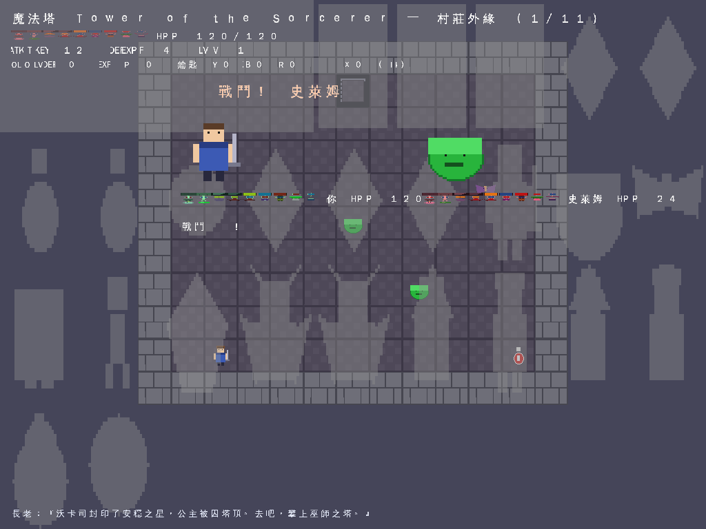
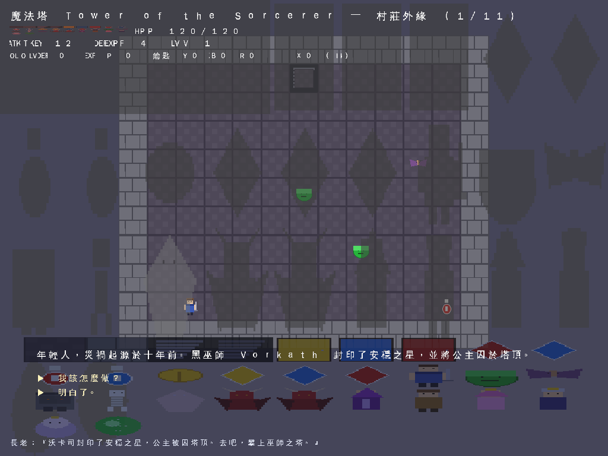
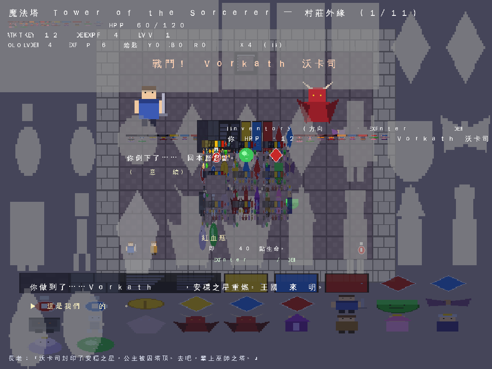
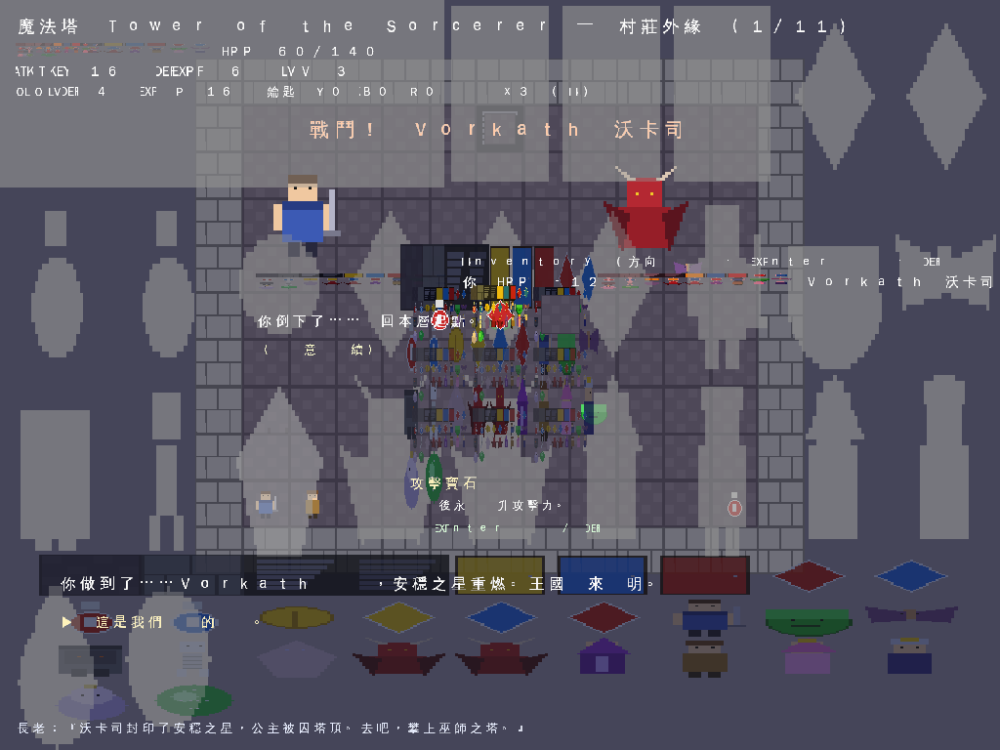
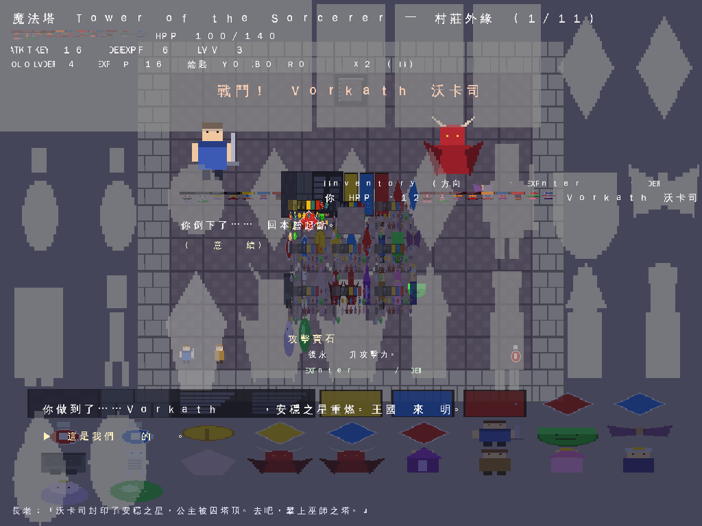

# Working Log — Player Item System (9-Grid Inventory UI)

Track what was done, by date.

- **2026-08-15** — **Modern logging system** added (`src/log.h`) and mixed into the
  lifecycle reporting. `toms::Logger` (C++17, no external deps): level filtering
  (Trace..Fatal), `{}` positional substitution via a fold-expression formatter
  (supports `{{`/`}}` escapes), streaming form `TOMS_LOG(Level) << ...`, automatic
  source location + timestamp, thread-safe, and an optional file sink
  (`setFile`). Macros: `TOMS_LOG_INFO(...)` etc. `Object::DumpLeaks()` and the demo's
  batch metric now route through it; main.cpp also enables a `toms.log` file sink.
  `log_test` verifies formatting/levels/file sink (all pass). (commit `fb4ead0`+)
- **2026-08-15** — **Texture class + TextureManager** added (`src/texture.h` / `src/texture.cpp`),
  reworked from FM79979 `Texture.h`/`TextureManager.h` into a modern Vulkan version.
  `Texture : public Object` loads images via **stb_image** (already in `external/stb/`)
  and uploads RGBA8 pixels into a LINEAR `VkImage` + `VkImageView` + `VkDescriptorSet`
  (mirrors `Renderer::uploadAtlas`). Key feature: `UpdatePixels(rgba,w,h)` re-uploads new
  pixel data into the Vulkan image (recreates the image if size changes). `TextureManager`
  is a singleton mapping name→`shared_ptr<Texture>` (modern RAII, no wchar_t).
  `Renderer::textureRefs()` exposes the Vulkan handles a `Texture` needs. `texture_test`
  (lavapipe) verifies load + UpdatePixels + manager + 0 leaks. Descriptor pool 2→32 sets.
- **2026-08-15** — **Extend leak detection to gameplay structs** (derive `Trackable`):
  Player, EnemyInst, DialogueNode, CombatState, Game, Stage, Audio now inherit `Trackable`
  so the object-lifecycle leak detector covers gameplay data, not just scene-graph nodes.
  `object_test` + the 5 demo scenarios (full/walk/combat/dialogue/stress) all report
  `live objects = 0, no leaks`. (commit `a774d80`)
- **2026-08-14** — **Object lifecycle counter / leak dump** added (`src/object.h`): every
  `Object` registers itself on construction and unregisters on destruction in a
  global `ObjectRegistry` (thread-safe, idempotent Remove so double-destroy can't
  go negative). `Object::LiveCount()` reports live objects; `Object::DumpLeaks()`
  (called at the end of `main.cpp` after the Game is destroyed) prints the count and,
  for any still-alive object, its **type + name** — the FMLog-style "after all
  resources destroyed, dump leaked objects" behavior. `object_test` extended with a
  leak-detection group. Verified: clean run reports `live objects = 0`; an
  intentionally leaked object is correctly dumped with type+name. (commit `bb49ca5`+)
  base for every game object, porting FM79979 `NamedTypedObject` intent. Each object
  knows its **type** (`Type()`/`StaticType()`/`IsType<T>`), its **name**
  (`Name()`/`SetName`), and a **unique ID** (`UniqueID()`), and is designed to be
  owned by `std::shared_ptr` so it **auto-releases** (`enable_shared_from_this` +
  `As<T>()` downcast + `Make<T>()` factory). `Node` now inherits `Object`, so every
  scene-graph node (GameObject/SpriteNode/TextNode/FullScreenSplash) is typed,
  named, and ref-countable for free. `object_test` verifies (7 groups): type/name/
  uid, IsType, As downcast, and shared_ptr auto-release. (commit `1fb3fb3`+)
  backend: a `BatchRenderer` ports the FM79979 `BatchDataMultiTexture` *group-then-flush*
  design — quads are accumulated and a new draw batch starts when the texture-set or
  blend mode changes. Renderer::end() now uploads a **4-vert + 6-index per quad** buffer
  and issues one `vkCmdDrawIndexed` per batch, writing vertices directly into the
  persistent GPU buffer (no per-frame temp realloc + full copy). Verified headless:
  437 quads -> **2 draw calls** (sprite atlas + font atlas), 1/3 fewer vertices than
  before. `IRenderer`/WebGL/WebGPU unchanged. (commit `f35212f`+)
  rendering to the scene-graph — `RenderTree()` walks the tree and **skips a whole
  subtree when its node is not visible** (parent.visible=false closes everything
  below). `SpriteNode` (common render: assign a texture+size+tint, it draws itself
  at its world rect), `TextNode` (render-bound text), `FullScreenSplash`. The item UI
  is now built as `modalRoot (visible = invOpen) -> splash + panel[bg, title,
  slot[bg, icon, highlight], desc texts]` and drawn via a single `modalRoot.RenderTree()`
  as the LAST draw call → renders on top; closing the inventory is one `SetVisible(false)`.
  (commit `0d336cb`+)
- **2026-08-14** — Inventory overlay changed to a full-screen black splash at
  transparent 50% (alpha 0.5) so the player focuses on the item UI. (commit `78dd2b6`+)
- **2026-08-14** — Initial item system: 9-grid extendable inventory UI, usable
  items (gems/potions/EXP crystal/scroll), pickup + use + discard. (commit `53778ff`)

---

## Entry: 2026-08-14 — Shared focus splash for combat & dialogue

**Branch:** `main`  ·  **Feature:** Focus splash (common modal helper)

Battle and talking scenes now use the **same** full-screen black splash at
alpha 0.5 as the inventory, via a new common helper `Game::drawFocusSplash()`
(called by combat, dialogue, and inventory overlays). This keeps the game
focused on what is happening.

Crucially, a modal also **blocks input to background objects**: `Game::modalActive()`
returns true while combat / dialogue / inventory is open, and `movePlayer()` /
`interact()` early-return on it; the Emscripten key handler swallows keys while
any modal is active, so mouse/touch/keyboard events never reach the world behind
the splash.




## Entry: 2026-08-14 — Inventory full-screen focus splash

**Branch:** `main`  ·  **Feature:** Player item system (9-grid inventory UI)

When the inventory UI is open, the scene is now covered by a **full-screen black
splash at transparency 50%** (alpha 0.5) so the player's focus is on the open
item panel. `Game::drawInventory()` draws a `0,0,W,H` black quad with
`tint[3]=0.5f` before the grid/panel.

## What was built

1. **Inventory model** — `Player::inv` (a `std::vector<std::string>` of item ids).
   Usable items (gems, potions, EXP crystal, scroll) are picked up into the
   inventory when the player walks onto an `item:` tile. Keys/coins still apply
   immediately.
2. **9-grid, extendable UI** — drawn as a centered 3×3 panel (always ≥ 9 slots,
   grows extra rows past 9 items). Each slot shows a dark box, the item's icon
   sprite, and a yellow selection highlight. A description panel below shows the
   selected item's name + description + usage hint.
3. **Item effects** (`data/items.json` → `Game::applyItem`):
   - `potion_red` / `potion_blue` — restore 40 / 80 HP
   - `gem_atk` / `gem_def` — permanent +ATK / +DEF
   - `exp_up` — grant EXP and run the level-up chain (HP/ATK/DEF grow per level)
   - `scroll` — warp to a target floor (`warp_to: stage03`)
   - `coin` / `key_*` — gold / keys (apply immediately)
4. **Controls** (wired in browser + headless demo):
   `I` toggle inventory · arrow keys move selection · `Enter` use · `D` discard.
5. **Assets** — generated 2 item icons (`exp_up.png`, `scroll.png`) and the
   missing `npc_handmaiden.png` (referenced by every stage but previously absent).

---

## Verification (real, offscreen PNG readback on the Linux/Vulkan path)

The engine was run headless (lavapipe) and screenshots captured at each step.

### 1. Inventory open (9-grid with icons + selection + description)


The scene is covered by a **full-screen black splash at transparent 50%** (alpha
0.5) so the player focuses on the item UI. The 3×3 grid renders on top with
distinct item icons, a yellow highlight on slot 0 (red potion), and the
description "紅血瓶 立即恢復 40 點生命。" below.

### 2. After using the EXP crystal (level-up)


Using the EXP crystal raised the player from **LV 3 → LV 4**, with HP 120→140,
ATK 12→16, DEF 4→6. The used item was consumed from the grid.

### 3. After using a potion (heal)


Using the red potion healed the player; the item was removed from the grid.

---

## Builds verified

| Target | Command | Result |
|--------|---------|--------|
| Linux / Vulkan | `cmake --build build-linux` | ✅ green, demo ran, 14 frames |
| WebGL2 (browser) | `emcmake cmake -B build-web -DWEB=ON` | ✅ green |
| WebGPU (browser) | `emcmake cmake -B build-webgpu -DWEB=ON -DWEB_BACKEND=WebGPU` | ✅ green |

Both standalone browser builds were regenerated into `web-gl/` and `web-gpu/`.

---

## How to run

Desktop (Vulkan):
```bash
cmake -S . -B build && cmake --build build -j4 && ./build/tower_vulkan
```
Browser:
```bash
./build_web.sh            # builds web-gl/ (WebGL2) and web-gpu/ (WebGPU)
python3 -m http.server 8099
# open http://localhost:8099/web-launch.html, press I for inventory
```

**Note:** The screenshots above are from the headless Vulkan (lavapipe) render
path. The same code runs in the browser backends; open the WebGL2/WebGPU build
and press `I` to see the live inventory UI.
