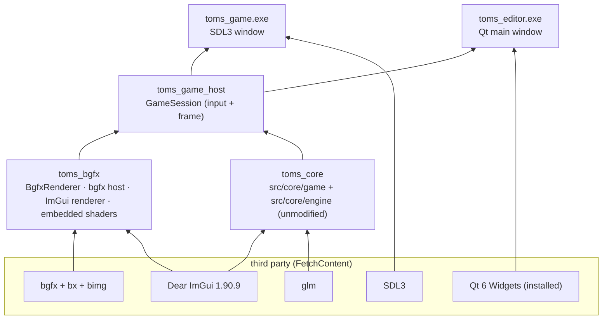

# 01 — 架構：現有遊戲如何在 Qt + bgfx 上執行

> 英文原文：[01_ARCHITECTURE.md](../01_ARCHITECTURE.md)

## 1. 分工

兩個最上層的資料夾：**`assets/` 放所有遊戲內容，`src/` 放所有原始碼。**

```
TOMS/                     the repository root
  CMakeLists.txt  CMakePresets.json  launch.vs.json
  cmake/          prerequisite checks (popups + links), third-party downloads
  tools/          check_env, build.cmd, build_web.cmd, serve_web.cmd, web_smoke_test.mjs
  docs/           these documents
  assets/         ALL GAME CONTENT (no code)
    media/        sprites, sfx, fonts           (TOMS_ASSET_DIR; mounted at /assets on the web)
    data/         stages, story, dialogue, items (TOMS_DATA_DIR;  mounted at /data)
  src/            ALL SOURCE CODE
    engine/       toms_bgfx: BgfxRenderer, bgfx host, ImGui-on-bgfx, shaders (.sc)
    game/         GameSession, main_sdl.cpp (desktop + web), compat/ shims, web/shell.html
    editor/       toms_editor (Qt6 + bgfx viewport); stage/ = the old Qt stage editor
    core/         the core game code (engine/ + game/), compiled unmodified (TOMS_CORE_SRC)
    third_party/  vendored headers: json, stb, miniaudio (TOMS_THIRD_PARTY_DIR)
```

`media/` 和 `data/` 必須是同層資料夾：遊戲程式碼以 `<media>/../data/...` 讀取資料
（configure 會檢查這點）。舊的 Vulkan 專案在 2026-09-27 移除（commit `979bcf3`）；
它的遊戲程式碼、內容、標頭和關卡編輯器已還原到上面的資料夾。建置時
**不修改** `src/core` 就直接編譯它；第 3 階段會就地重寫它，並在重寫 `src/engine` 時把 `src/game` 合併進去
（[04](04_MIGRATION_PLAN.md)）。舊專案的其他東西
（Vulkan/WebGPU 渲染器、舊的建置檔、`docs/EngineBlueprint`）只留在 git 歷史中
（`git show 979bcf3^:<path>`）。

## 2. 建置目標以及誰連結誰



**發行規則：** 只發行 `toms_game.exe`。它連結 bgfx 和 SDL3，**不含 Qt**。
`windows-shipping` preset 會關掉編輯器，也完全不搜尋 Qt，所以沒有 Qt 的機器
也能建置要發行的遊戲。

## 3. 舊程式碼如何不修改就在 bgfx 上執行

舊遊戲自己建立它的渲染器：

```cpp
// src/game/core/game_assets.cpp (unchanged)
ren = new Renderer();          // was the Vulkan renderer
ren->init(1280, 720);
```

`toms_core` 編譯這些原始碼時，**include 路徑的第一順位是 `src/game/compat/`**。
那個資料夾有它自己的 `renderer.h`：

```cpp
// game/compat/renderer.h
#include "bgfx_renderer.h"
using Renderer = toms::next::BgfxRenderer;
```

所以 `#include "renderer.h"` 和 `new Renderer()` 會解析成同一個
`IRenderer` 介面（`src/core/engine/render_iface.h`）的 bgfx 實作，桌機和 web 都一樣。舊的 Vulkan、
WebGL 和 WebGPU 渲染器、它們的 ImGui 層，以及舊的 GLFW / Emscripten 進入點，
都在 2026-09-27 移除（留在 git 歷史中）。

`BgfxRenderer` 重現 Vulkan 渲染器的輸出：

| 行為 | 舊的 Vulkan `renderer.cpp`（已移除） | `BgfxRenderer` |
|---|---|---|
| 設計解析度 | 1024×768，加黑邊 | 相同（`computeAspectFitViewport`、`deviceToDesign`） |
| 繪製順序 | 先畫所有 sprite，再畫所有文字 | sprite 一個批次；所有文字和 UI 都用 RmlUi（[08](08_RMLUI.md)） |
| Atlas | RGBA8 sRGB、nearest、clamp | `BGFX_TEXTURE_SRGB`、point、clamp |
| 混色 | src-alpha / inverse src-alpha | `BGFX_STATE_BLEND_ALPHA` |
| 純色方塊 | 只有色調 | 相同（`fs_sprite.sc`） |
| 背景 | sRGB swapchain 上的 `kBackgroundClearColor` | 相同顏色，`BGFX_RESET_SRGB_BACKBUFFER` |
| `savePNG` | 空實作 | 透過 bgfx 真正截圖 |

和 Vulkan 渲染器不同，`BgfxRenderer` 不擁有視窗。**宿主（host）**擁有視窗
和 bgfx；渲染器只建立貼圖並送出繪製。

## 4. 一個畫面

```mermaid
sequenceDiagram
    participant Host as Host (SDL3 loop or Qt timer)
    participant S as GameSession
    participant G as Game (src/core)
    participant R as BgfxRenderer
    participant B as bgfx
    Host->>S: frame(dt, InputState, backbuffer size)
    S->>G: update(dt), key/mouse actions (ported from old main.cpp)
    S->>S: ImGui new frame; F1/F2 developer windows
    S->>G: draw() (the world)
    G->>R: begin / drawSprite / end
    R->>B: view 0 clear, view 1 letterboxed sprites
    S->>G: buildUiState() -> RmlUi documents (game_ui.cpp)
    S->>B: view 2 RmlUi (all UI), view 3 ImGui
    Host->>B: bgfx::frame()
```

- **View：** 0 = 清除整個 backbuffer，1 = 設計空間中的遊戲，2 = ImGui。更多的 view
  （例如 3D pass）會插在遊戲 view 之前。
- **單執行緒 bgfx：** 在 `bgfx::init()` 之前先呼叫 `bgfx::renderFrame()`，所以渲染
  在呼叫端的執行緒進行。SDL 迴圈和 Qt timer 都是這樣預期的。
- **輸入：** `GameSession` 接受與工具包無關的 `InputState`（按鍵狀態、以 backbuffer
  像素表示的滑鼠）。SDL3（`main_sdl.cpp`）和 Qt（`bgfx_viewport.cpp`）各自從自己的事件填入它，
  所以兩者玩起來一樣。按鍵規則是舊的
  GLFW `main.cpp`（2026-09-27 移除）逐行移植過來的。

## 5. 編輯器中的 Qt + bgfx

`BgfxViewport`（一個 `QWidget`）是 bgfx 在 Qt 中繪製的地方：

1. 這個 widget 有自己的原生視窗：`Qt::WA_NativeWindow`，加上 `WA_PaintOnScreen` 和一個
   回傳 `nullptr` 的 `paintEngine()`，所以 Qt 永遠不會蓋過 bgfx 繪製。
2. 第一次 `showEvent` 時，widget 的 `winId()`（一個 `HWND`）會以
   `platformData.nwh` 傳給 `bgfx::init`。
3. 一個 `QTimer` 先呼叫 `GameSession::frame()`，再呼叫 `bgfx::frame()`。開啟 vsync 時，`bgfx::frame()`
   控制迴圈的節奏；Qt 事件在畫面之間處理。
4. `resizeEvent` 以**裝置像素**大小呼叫 `bgfx::reset`
   （`width() * devicePixelRatioF()`），所以 HiDPI 是正確的。
5. 鍵盤和滑鼠會對應到 `InputState`。`focusNextPrevChild` 回傳 `false`，所以 Tab
   會送到遊戲（關卡選擇），而不是移動 Qt 的焦點。

讓它保持穩定的規則：

- **每個行程只有一個 bgfx。** 第二個 viewport（例如 prefab 預覽）必須使用
  `bgfx::createFrameBuffer(nativeWindowHandle, w, h)` 和它自己的 view ID，而不是第二次
  `bgfx::init`。
- **不要改變 viewport 的父元件**（例如把它變成浮動的停駐面板）。改變父元件會
  重建 `HWND`，bgfx 就需要新的 handle。讓它保持為中央 widget 或固定的
  分頁；如果之後需要浮動的 viewport，就在 `QEvent::WinIdChange` 時重建它的 frame buffer。
- **依序關閉：** 先 `GameSession::stop()`（貼圖、程式），再 `bgfx::shutdown()`，
  而且要在 widget 的視窗還存在時。`~BgfxViewport` 會做這件事。

舊的關卡編輯器（`src/editor/stage`，一個 `QMainWindow`）原封不動編譯進 `toms_editor`，
並顯示成一個分頁（`setWindowFlags(Qt::Widget)`）。

## 6. Shader

- 原始檔：`src/engine/shaders/*.sc`（bgfx 類似 GLSL 的方言）和一個 `varying.def.sc`。
- 建置時，**shaderc**（從 bgfx.cmake 建置）會把每一個編譯成 DXBC（Direct3D 11/12）、
  SPIR-V（Vulkan）、GLSL（OpenGL）和 ESSL（GLES / 未來的 WebGL2 版）。結果會變成
  C 標頭，嵌入執行檔中（`embedded_shaders.cpp`），所以執行時不需要複製或載入任何 shader 檔。
- sprite shader 的三份舊副本（SPIR-V、GLSL ES、WGSL）換成一對
  `vs_sprite.sc` / `fs_sprite.sc`。

## 7. 長期計畫在哪裡

這個專案要前往的引擎設計（SDL3 + bgfx 執行期、Qt 編輯器、資源系統、
2D/3D 渲染器、prefab）在 `TOMS/docs/EngineBlueprint/`。這個資料夾是它的第一步。
[04_MIGRATION_PLAN.md](04_MIGRATION_PLAN.md) 列出各個階段。
