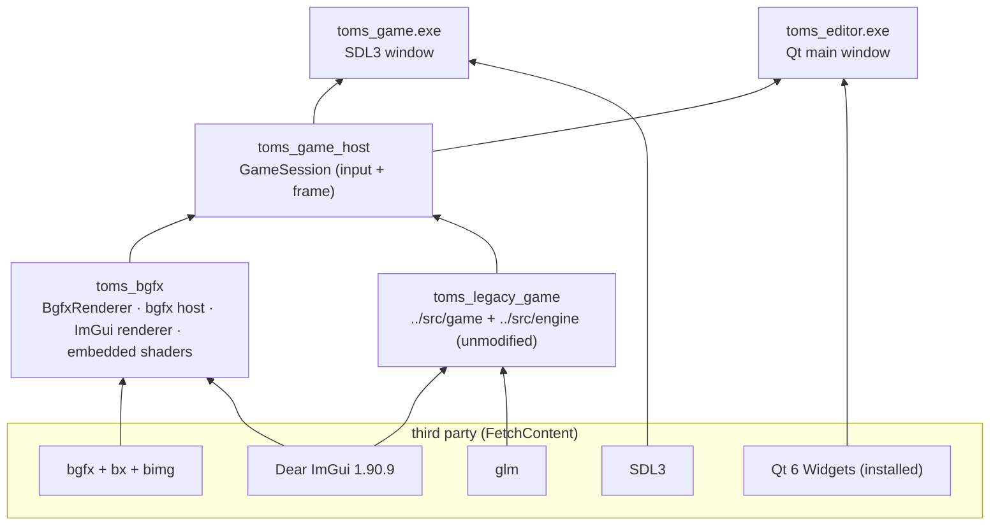

# 01 — Architecture: how the current game runs on Qt + bgfx

## 1. The split

```
TOMS/                         the original project (Vulkan + GLFW + WebGL). Untouched.
  src/  assets/  data/  external/  editor/
  toms_next/                  the new project (this folder). Everything new lives here.
    CMakeLists.txt  CMakePresets.json  launch.vs.json
    cmake/        prerequisite checks (popups + links), third-party downloads
    engine/       toms_bgfx: BgfxRenderer, bgfx host, ImGui-on-bgfx, shaders (.sc)
    game/         toms_legacy_game (= ../src on bgfx), GameSession, toms_game.exe (SDL3)
    editor/       toms_editor.exe (Qt6 + bgfx viewport + the old stage editor)
    tools/        check_env.cmd, build.cmd, show_message.ps1
    docs/         these documents
```

`toms_next` reuses the game code, assets and data from the parent folder **without editing
them**. The old Vulkan build keeps working side by side until the migration is finished
([04](04_MIGRATION_PLAN.md)).

## 2. Targets and what links what



**Shipping rule:** only `toms_game.exe` ships. It links bgfx and SDL3 and **no Qt**. The
`windows-shipping` preset turns the editor off and never searches for Qt, so a machine without Qt
can build the shipped game.

## 3. How the old code runs on bgfx without edits

The old game creates its renderer itself:

```cpp
// src/game/core/game_assets.cpp (unchanged)
ren = new Renderer();          // was the Vulkan renderer
ren->init(1280, 720);
```

`toms_legacy_game` compiles those sources with **`game/compat/` first on the include path**.
That folder has its own `renderer.h`:

```cpp
// toms_next/game/compat/renderer.h
#include "bgfx_renderer.h"
using Renderer = toms::next::BgfxRenderer;
```

So `#include "renderer.h"` and `new Renderer()` resolve to the bgfx implementation of the same
`IRenderer` interface (`src/engine/render_iface.h`). An empty `compat/vk_util.h` covers the one
other Vulkan include. The Vulkan-only files (`renderer.cpp`, `imgui_layer.cpp`, `main.cpp`) are
simply not compiled.

`BgfxRenderer` reproduces the Vulkan renderer's output:

| Behaviour | Vulkan `renderer.cpp` | `BgfxRenderer` |
|---|---|---|
| Design resolution | 1024×768, letterboxed | same (`computeAspectFitViewport`, `deviceToDesign`) |
| Draw order | all sprites, then all text | same: two batches, one draw call each |
| Atlases | RGBA8 sRGB, nearest, clamp | `BGFX_TEXTURE_SRGB`, point, clamp |
| Blending | src-alpha / inverse src-alpha | `BGFX_STATE_BLEND_ALPHA` |
| Solid quads | tint only | same (`fs_sprite.sc`) |
| Background | `kBackgroundClearColor` on an sRGB swapchain | same colour, `BGFX_RESET_SRGB_BACKBUFFER` |
| Font atlas too large | silently draws no text | logs the size and the GPU limit |
| `savePNG` | stub | real screenshot via bgfx |

Unlike the Vulkan renderer, `BgfxRenderer` does not own a window. The **host** owns the window
and bgfx; the renderer only creates textures and submits draws.

## 4. One frame

```mermaid
sequenceDiagram
    participant Host as Host (SDL3 loop or Qt timer)
    participant S as GameSession
    participant G as Game (legacy)
    participant R as BgfxRenderer
    participant B as bgfx
    Host->>S: frame(dt, InputState, backbuffer size)
    S->>G: update(dt), key/mouse actions (ported from old main.cpp)
    S->>S: ImGui new frame; F1/F2/Tab dev windows
    S->>G: draw()
    G->>R: begin / drawSprite / drawText / end
    R->>B: view 0 clear, view 1 letterboxed quads
    S->>B: view 2 ImGui
    Host->>B: bgfx::frame()
```

- **Views:** 0 = clear the whole backbuffer, 1 = the game in design space, 2 = ImGui. More views
  (for example a 3D pass) slot in before the game view.
- **Single-threaded bgfx:** `bgfx::renderFrame()` is called before `bgfx::init()`, so rendering
  happens on the calling thread. That is what both the SDL loop and the Qt timer expect.
- **Input:** `GameSession` takes a toolkit-neutral `InputState` (key levels, mouse in backbuffer
  pixels). SDL3 (`main_sdl.cpp`) and Qt (`bgfx_viewport.cpp`) each fill it from their own events,
  so the game plays the same in both. The key rules are a line-by-line port of the old
  `src/game/core/main.cpp`.

## 5. Qt + bgfx in the editor

`BgfxViewport` (a `QWidget`) is where bgfx draws inside Qt:

1. The widget gets its own native window: `Qt::WA_NativeWindow`, plus `WA_PaintOnScreen` and a
   `paintEngine()` that returns `nullptr`, so Qt never paints over bgfx.
2. On the first `showEvent`, the widget's `winId()` (an `HWND`) is passed to `bgfx::init` as
   `platformData.nwh`.
3. A `QTimer` calls `GameSession::frame()` and then `bgfx::frame()`. With vsync on, `bgfx::frame()`
   paces the loop; Qt events are handled between frames.
4. `resizeEvent` calls `bgfx::reset` with the size in **device pixels**
   (`width() * devicePixelRatioF()`), so HiDPI is correct.
5. Keys and the mouse are mapped to `InputState`. `focusNextPrevChild` returns `false`, so Tab
   reaches the game (stage select) instead of moving Qt's focus.

Rules that keep this stable:

- **bgfx is one per process.** A second viewport (a prefab preview, say) must use
  `bgfx::createFrameBuffer(nativeWindowHandle, w, h)` and its own view ids, not a second
  `bgfx::init`.
- **Do not re-parent the viewport** (for example by making it a floating dock). Re-parenting
  recreates the `HWND`, and bgfx would need the new handle. Keep it the central widget or a fixed
  tab; if a floating viewport is needed later, re-create its frame buffer on `QEvent::WinIdChange`.
- **Shut down in order:** `GameSession::stop()` (textures, programs), then `bgfx::shutdown()`,
  while the widget's window still exists. `~BgfxViewport` does this.

The old stage editor (`TOMS/editor/src`, a `QMainWindow`) is compiled into `toms_editor`
unchanged and shown as a tab (`setWindowFlags(Qt::Widget)`).

## 6. Shaders

- Sources: `engine/shaders/*.sc` (bgfx's GLSL-like dialect) and one `varying.def.sc`.
- At build time **shaderc** (built from bgfx.cmake) compiles each one for DXBC (Direct3D 11/12),
  SPIR-V (Vulkan), GLSL (OpenGL) and ESSL (GLES / the future WebGL2 build). The results become
  C headers that are embedded in the executable (`embedded_shaders.cpp`), so no shader files are
  copied or loaded at runtime.
- The three old copies of the sprite shader (SPIR-V, GLSL ES, WGSL) are replaced by one
  `vs_sprite.sc` / `fs_sprite.sc` pair.

## 7. Where the long-term plan is

The engine design this is heading towards (SDL3 + bgfx runtime, Qt editor, resource system,
2D/3D renderer, prefabs) is in `TOMS/docs/EngineBlueprint/`. This folder is its first step.
[04_MIGRATION_PLAN.md](04_MIGRATION_PLAN.md) lists the phases.
